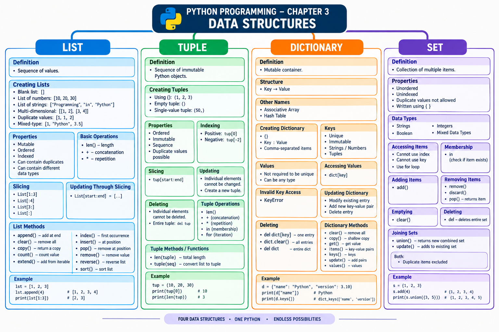

# LJ-Python-sem3-chapter3-explained
# 📘 PYTHON PROGRAMMING — CHAPTER 3

# Data Structures in Python

## STEP 1 — Deep Explanation

The PPT introduces **four basic inbuilt data structures in Python**:

1. **List**
    
2. **Tuple**
    
3. **Dictionary**
    
4. **Set**
    

These four structures are the complete scope of this chapter in the uploaded PPT.

---

# 1. Data Structure

A **data structure** is a way of organizing and storing data so that it can be used and manipulated efficiently.

According to the PPT, Python provides four basic inbuilt data structures:

```text
                 DATA STRUCTURES
                       │
        ┌──────────────┼──────────────┐
        │              │              │
       List           Tuple       Dictionary
                                       │
                                      Set
```

The four structures covered in this chapter are:

|Data Structure|Main Idea|
|---|---|
|**List**|Ordered collection that can be changed|
|**Tuple**|Ordered collection that cannot be changed|
|**Dictionary**|Collection of key-value pairs|
|**Set**|Unordered, unindexed collection without duplicates|

The PPT then discusses each structure in detail.

---

# 2. LIST

## 2.1 Definition of List

A **list is a sequence of values**.

The PPT compares a list with a string:

- In a **string**, the values are characters.
    
- In a **list**, the values can be **any type**.
    
- The values in a list are called **elements** or sometimes **items**.
    

Lists are created by enclosing their elements inside **square brackets `[ ]`**.

### Basic syntax

```python
List = [element1, element2, element3]
```

Example:

```python
numbers = [10, 20, 30]
```

---

# 3. Creating a List

There are several ways to create lists.

## 3.1 Creating a Blank List

A blank list contains no elements.

```python
List = []
print("Blank List: ", List)
```

Output:

```text
Blank List : []
```

So:

```text
[]  → Empty / Blank List
```

This example is directly shown in the PPT.

---

# 4. Creating a List of Numbers

A list can contain numbers.

```python
List = [10, 20, 30]
print("List of numbers: ", List)
```

Output:

```text
[10, 20, 30]
```

Here:

```text
List
 │
 ├── 10
 ├── 20
 └── 30
```

Each number is an element of the list.

---

# 5. Creating a List of Strings and Accessing Elements

A list can contain strings.

Example from the PPT:

```python
List = ["Programming", "in", "Python"]

print("List Items: ")
print(List[0])
print(List[2])
```

Output:

```text
List Items:
Programming
Python
```

Notice that list indexing starts from **0**.

```text
Index:     0              1        2
           ↓              ↓        ↓
List = ["Programming",   "in",   "Python"]
```

Therefore:

```python
List[0]
```

gives:

```text
Programming
```

and

```python
List[2]
```

gives:

```text
Python
```

The PPT demonstrates accessing list elements through indexes.

---

# 6. Multi-Dimensional List

A list can contain another list.

This is called **nesting a list inside a list**.

Example:

```python
List = [['Programming', 'in'], ['Python']]
print("Multi-Dimensional List: ")
print(List)
```

Output:

```text
[['Programming', 'in'], ['Python']]
```

Conceptually:

```text
Outer List
│
├── Inner List 1
│   ├── Programming
│   └── in
│
└── Inner List 2
    └── Python
```

This allows lists to represent data in multiple levels or dimensions.

### Exam Point ⭐

A **multi-dimensional list** can be created by **nesting one list inside another list**.

---

# 7. Duplicate Values in a List

A list may contain **duplicate values**.

Importantly, duplicate values have their **distinct positions**.

Example:

```python
List = [1, 2, 4, 4, 3, 3, 3, 6, 5]
print(List)
```

Output:

```text
[1, 2, 4, 4, 3, 3, 3, 6, 5]
```

Here:

```text
4 → occurs twice
3 → occurs three times
```

The duplicates are not automatically removed.

This is an important difference between a **list** and a **set**.

---

# 8. Mixed-Type List

A list can contain different types of values.

Example:

```python
List = [1, 2, 'Programming', 4, 'in', 6, 'Python']
print(List)
```

Output:

```text
[1, 2, 'Programming', 4, 'in', 6, 'Python']
```

Here the list contains:

- Integers
    
- Strings
    

So a Python list can contain mixed types of values.

---

# 9. Lists are Mutable

One of the most important properties of a list is that **lists are mutable**.

### Meaning of mutable

**Mutable** means that the contents of the object can be changed after it has been created.

The PPT explains that, unlike strings, lists are mutable because we can:

- Change the order of items.
    
- Reassign an item in the list.
    

### Example

```python
Numbers = [17, 123]

print("Before: ", Numbers)

Numbers[1] = 5

print("After: ", Numbers)
```

Output:

```text
Before: [17, 123]
After:  [17, 5]
```

The second element changed:

```text
Before:

[17, 123]
     ↑
   index 1


After:

[17, 5]
     ↑
   changed
```

This proves that a list can be modified.

### ⭐ Exam Point

**List = Mutable**

Remember:

```text
Mutable → Can be changed
```

---

# 10. `len()` Function with List

The `len()` function is used to find the **length**, or number of elements, in a list.

Example:

```python
List = [10, 20, 14]
print(len(List))
```

Output:

```text
3
```

There are three elements:

```text
[10, 20, 14]
  │   │   │
  └───┴───┴── 3 elements
```

Therefore:

```python
len(List)
```

returns:

```text
3
```

The PPT explicitly defines `len()` as finding the length/no. of elements in a list.

---

# 11. List Operations

The PPT covers two important list operators:

1. `+`
    
2. `*`
    

---

## 11.1 `+` Operator — Concatenation

The `+` operator **concatenates lists**.

Concatenation means joining two lists together.

Example:

```python
a = [1, 2, 3]
b = [4, 5, 6]

c = a + b

print(c)
```

Output:

```text
[1, 2, 3, 4, 5, 6]
```

Diagram:

```text
a = [1, 2, 3]

b = [4, 5, 6]

       +
       ↓

c = [1, 2, 3, 4, 5, 6]
```

### Exam Point ⭐

```text
+ operator → Concatenates lists
```

---

# 12. `*` Operator — Repetition

The `*` operator repeats a list a specified number of times.

Example:

```python
a = [1]

a = a * 3

print(a)
```

Output:

```text
[1, 1, 1]
```

Conceptually:

```text
[1] × 3

     ↓

[1, 1, 1]
```

### Exam Point ⭐

```text
* operator → Repeats a list
```

---

# 13. List Slices

A **slice operator** is used to obtain a portion of a list.

Example:

```python
List = ['a', 'b', 'c', 'd', 'e', 'f']
```

Consider:

```python
List[1:3]
```

Output:

```text
['b', 'c']
```

The ending index is not included.

---

## 13.1 `List[1:3]`

```text
Index:   0    1    2    3    4    5
         ↓    ↓    ↓    ↓    ↓    ↓
List =  ['a', 'b', 'c', 'd', 'e', 'f']

              └──────┘
             1      3
```

Result:

```text
['b', 'c']
```

---

## 13.2 `List[:4]`

If the first index is omitted, slicing begins at the beginning.

```python
List[:4]
```

Output:

```text
['a', 'b', 'c', 'd']
```

---

## 13.3 `List[3:]`

If the second index is omitted, slicing continues until the end.

```python
List[3:]
```

Output:

```text
['d', 'e', 'f']
```

The PPT demonstrates all three forms.

---

# 14. Omitting Slice Indexes

The PPT specifically explains:

### First index omitted

```python
List[:4]
```

The slice starts at the beginning.

### Second index omitted

```python
List[3:]
```

The slice goes to the end.

### Both indexes omitted

```python
List[:]
```

The whole list is copied.

Example:

```python
List = ['a', 'b', 'c', 'd', 'e', 'f']

print(List[:])
```

Output:

```text
['a', 'b', 'c', 'd', 'e', 'f']
```

### Quick Revision

```text
List[a:b]
   │ │
   │ └── ending position
   └──── starting position

List[:b] → beginning to b
List[a:] → a to end
List[:]  → complete list
```

---

# 15. Updating Multiple List Elements Using Slicing

A slice operator on the **left side of an assignment** can update multiple elements.

Example:

```python
List = ['a', 'b', 'c', 'd', 'e', 'f']

List[1:3] = ['x', 'y']

print(List)
```

Output:

```text
['a', 'x', 'y', 'd', 'e', 'f']
```

Before:

```text
['a', 'b', 'c', 'd', 'e', 'f']
      ↑    ↑
      b    c
```

After:

```text
['a', 'x', 'y', 'd', 'e', 'f']
      ↑    ↑
      x    y
```

So slicing can also be used to update multiple elements at once.

---

# 16. List Methods

Python provides a set of built-in methods that can be used with lists.

The PPT lists the following methods:

|Method|Purpose|
|---|---|
|`append()`|Adds an element at the end|
|`clear()`|Removes all elements|
|`copy()`|Returns a copy|
|`count()`|Counts specified value|
|`extend()`|Adds elements of another iterable|
|`index()`|Returns index of first matching element|
|`insert()`|Adds element at specified position|
|`pop()`|Removes element at specified position|
|`remove()`|Removes first matching value|
|`reverse()`|Reverses list|
|`sort()`|Sorts list|

---

# 17. `append()`

`append()` **adds an element at the end of the list**.

Example:

```python
fruits = ['apple', 'banana', 'cherry']

fruits.append('orange')

print(fruits)
```

Output:

```text
['apple', 'banana', 'cherry', 'orange']
```

Before:

```text
['apple', 'banana', 'cherry']
```

After:

```text
['apple', 'banana', 'cherry', 'orange']
                                      ↑
                                  added here
```

---

# 18. `clear()`

`clear()` **removes all elements from the list**.

Example:

```python
fruits = ['apple', 'banana', 'cherry', 'orange']

fruits.clear()

print(fruits)
```

Output:

```text
[]
```

So:

```text
Before → [apple, banana, cherry, orange]

clear()

After  → []
```

---

# 19. `copy()`

`copy()` **returns a copy of the list**.

Example:

```python
fruits = ['apple', 'banana', 'cherry', 'orange']

x = fruits.copy()

print(x)
```

Output:

```text
['apple', 'banana', 'cherry', 'orange']
```

---

# 20. `count()`

`count()` returns the **number of elements with the specified value**.

Example:

```python
fruits = ['apple', 'banana', 'cherry']

x = fruits.count('cherry')

print(x)
```

Output:

```text
1
```

Therefore:

```text
count(value) → number of occurrences of value
```

---

# 21. `extend()`

`extend()` adds the elements of a list, or another iterable, to the **end of the current list**.

Example:

```python
fruits = ['apple', 'banana', 'cherry']
cars = ['Ford', 'BMW', 'Volvo']

fruits.extend(cars)

print(fruits)
```

Output:

```text
['apple', 'banana', 'cherry', 'Ford', 'BMW', 'Volvo']
```

Conceptually:

```text
fruits = [apple, banana, cherry]

cars = [Ford, BMW, Volvo]

             extend
                ↓

fruits = [apple, banana, cherry, Ford, BMW, Volvo]
```

---

# 22. `index()`

`index()` returns the **index of the first element with the specified value**.

Example:

```python
fruits = ['apple', 'banana', 'cherry', 'orange']

x = fruits.index('apple')

print(x)
```

Output:

```text
0
```

Because `apple` is at index `0`.

---

# 23. `insert()`

`insert()` **adds an element at a specified position**.

Example:

```python
fruits = ['apple', 'banana', 'cherry']

fruits.insert(1, 'orange')

print(fruits)
```

Output:

```text
['apple', 'orange', 'banana', 'cherry']
```

Here:

```text
Index:   0          1          2          3
         ↓          ↓          ↓          ↓
       apple     orange     banana     cherry
```

`orange` was inserted at index `1`.

---

# 24. `pop()`

`pop()` **removes the element at the specified position**.

Example:

```python
fruits = ['apple', 'banana', 'cherry']

fruits.pop(1)

print(fruits)
```

Output:

```text
['apple', 'cherry']
```

The element at index `1`, `banana`, was removed.

---

# 25. `remove()`

`remove()` removes the **first item with the specified value**.

Example:

```python
fruits = ['apple', 'banana', 'cherry']

fruits.remove('banana')

print(fruits)
```

Output:

```text
['apple', 'cherry']
```

Difference to remember:

```text
pop()    → works using position/index
remove() → works using value
```

---

# 26. `reverse()`

`reverse()` **reverses the order of the list**.

Example:

```python
fruits = ['apple', 'banana', 'cherry']

fruits.reverse()

print(fruits)
```

Output:

```text
['cherry', 'banana', 'apple']
```

Before:

```text
apple → banana → cherry
```

After:

```text
cherry → banana → apple
```

---

# 27. `sort()`

The PPT lists `sort()` as the method that **sorts the list**.

The example shown on the PPT appears to contain a code inconsistency: the heading says `sort()`, but the displayed code uses `remove('banana')`, and its shown output remains the fruit list. Therefore, for this chapter we preserve the PPT's stated concept—**`sort()` sorts a list**—rather than silently treating the displayed example as a correct sorting demonstration.

---

# 28. TUPLES

## 28.1 Definition

A **tuple is a sequence of immutable Python objects**.

The PPT describes a tuple as:

- Ordered
    
- Unchangeable
    
- A sequence, like a list
    

The major difference is:

```text
List  → uses [ ]
Tuple → uses ( )
```

and tuples **cannot be changed like lists**.

### Basic comparison

```text
List:
[10, 20, 30]

Tuple:
(10, 20, 30)
```

---

# 29. Creating a Tuple

A tuple can be created by placing **comma-separated values** together.

Parentheses can optionally be used.

Examples from the PPT:

```python
tup1 = ('ABC', 'pqr', 1000, 2000)

tup2 = (1, 2, 3, 4, 5)

tup3 = ("a", "b", "c", "d")
```

Output:

```text
('ABC', 'pqr', 1000, 2000)
(1, 2, 3, 4, 5)
('a', 'b', 'c', 'd')
```

---

# 30. Empty Tuple

An empty tuple contains no elements.

It is written as:

```python
tup1 = ()
```

So:

```text
() → Empty Tuple
```

---

# 31. Single-Value Tuple

A tuple containing only one value requires a **comma**.

Correct:

```python
tup1 = (50,)
```

The comma is important.

```text
(50,) → Tuple
(50)  → ordinary parenthesized value, not a single-element tuple
```

This is an important exam point.

---

# 32. Tuple Indexing and Slicing

Like string indices:

- Tuple indices start at `0`.
    
- Tuples can be sliced.
    
- Tuples can be concatenated.
    

Example:

```python
tup1 = ('physics', 'chemistry', 1997, 2000)
tup2 = (1, 2, 3, 4, 5, 6, 7)

print("tup1[0]: ", tup1[0])
print("tup2[1:5]: ", tup2[1:5])
```

Output:

```text
tup1[0]: physics
tup2[1:5]: (2, 3, 4, 5)
```

---

# 33. Updating Tuples

Tuples are **immutable**.

That means:

> The values of tuple elements cannot be changed.

For example, this is not valid:

```python
tup1[0] = 100
```

The PPT instead demonstrates creating a **new tuple** by combining existing tuples.

```python
tup1 = (12, 34.56)
tup2 = ('abc', 'xyz')

tup3 = tup1 + tup2

print(tup3)
```

Output:

```text
(12, 34.56, 'abc', 'xyz')
```

So we cannot directly modify the existing tuple, but we can create another tuple.

---

# 34. Deleting Tuple Elements

Individual tuple elements **cannot be removed**.

The PPT explains that another tuple can be created without the unwanted elements.

However, an **entire tuple** can be deleted using `del`.

Example:

```python
tup = ('ABC', 'pqr', 1997, 2000)

print(tup)

del tup
```

After:

```python
print(tup)
```

an exception occurs because the tuple no longer exists.

The PPT shows a:

```text
NameError
```

after trying to use `tup` following `del tup`.

### ⭐ Important

```text
Individual tuple element → Cannot be deleted
Entire tuple             → Can be deleted using del
```

---

# 35. Tuple Operations

Tuples respond to the `+` and `*` operators similarly to strings.

Here:

```text
+ → Concatenation
* → Repetition
```

The result is a **new tuple**.

The PPT lists these operations:

|Python Expression|Result|Meaning|
|---|---|---|
|`len((1,2,3))`|`3`|Length|
|`(1,2,3)+(4,5,6)`|`(1,2,3,4,5,6)`|Concatenation|
|`('Hi!',)*4`|`('Hi!','Hi!','Hi!','Hi!')`|Repetition|
|`3 in (1,2,3)`|`True`|Membership|
|`for x in (1,2,3): print(x)`|`1 2 3`|Iteration|

---

# 36. Tuple Indexing

Because tuples are sequences, indexing works in the same way as with strings.

Consider:

```python
L = ('spam', 'Spam', 'SPAM!')
```

### `L[2]`

```python
L[2]
```

gives:

```text
'SPAM!'
```

because indexes start at zero.

### `L[-2]`

```python
L[-2]
```

gives:

```text
'Spam'
```

because negative indexes count from the right.

### `L[1:]`

```python
L[1:]
```

fetches a section using slicing.

The PPT presents these examples under indexing and slicing.

---

# 37. Tuple Methods

The PPT presents the following tuple methods/functions:

|Method / Function|Purpose|
|---|---|
|`len(tuple)`|Gives total length of tuple|
|`tuple(seq)`|Converts a list into a tuple|

---

## 37.1 `len(tuple)`

`len()` gives the total length of the tuple.

Example:

```python
tuple1, tuple2 = (123, 'xyz', 'zara'), (456, 'abc')

print("First tuple length : ", len(tuple1))
print("Second tuple length : ", len(tuple2))
```

Output:

```text
First tuple length : 3
Second tuple length : 2
```

---

## 37.2 `tuple(seq)`

The PPT lists:

```text
tuple(seq)
```

as converting a list into a tuple.

Conceptually:

```text
List
 ↓
tuple()
 ↓
Tuple
```

---

# 38. DICTIONARY

## 38.1 Definition

A **dictionary** is a mutable container type that can store any number of Python objects, including other container types.

A dictionary consists of **pairs** called **items**.

Each item contains:

```text
Key → Value
```

The PPT also states that Python dictionaries are known as:

- **Associative arrays**
    
- **Hash tables**
    

Example:

```python
dict1 = {
    'Alice': '2341',
    'Beth': '9102',
    'Cecil': '3258'
}
```

Conceptually:

```text
Dictionary
│
├── Alice → 2341
├── Beth  → 9102
└── Cecil → 3258
```

---

# 39. Dictionary Syntax

Dictionary syntax uses:

- Curly braces `{ }`
    
- A colon `:` between key and value
    
- Commas separating items
    

Example:

```python
dict1 = {
    'Alice': '2341',
    'Beth': '9102',
    'Cecil': '3258'
}
```

Structure:

```text
{
   key : value,
   key : value,
   key : value
}
```

An empty dictionary is:

```python
{}
```

---

# 40. Dictionary Keys and Values

The PPT specifies:

### Keys

- Keys are **unique** within a dictionary.
    
- Keys must be of an **immutable data type**.
    
- Examples include:
    
    - Strings
        
    - Numbers
        
    - Tuples
        

### Values

- Values do not have to be unique.
    
- Values can be of any type.
    

### Important diagram

```text
Dictionary
   │
   ├── Key → unique
   │
   └── Value → may repeat
```

---

# 41. Accessing Dictionary Values

Dictionary values can be accessed using square brackets and the key.

Example:

```python
dict1 = {
    'Name': 'Zara',
    'Age': 7,
    'Class': 'First'
}

print(dict1['Name'])
print(dict1['Age'])
print(dict1['Class'])
```

Output:

```text
Zara
7
First
```

The PPT demonstrates accessing values using their corresponding keys.

---

# 42. Accessing a Non-Existing Dictionary Key

Suppose:

```python
dict1 = {
    'Name': 'Zara',
    'Age': 7,
    'Class': 'First'
}
```

and we try:

```python
print(dict1['Alice'])
```

`Alice` is not a key in the dictionary.

The PPT shows that this produces:

```text
KeyError: 'Alice'
```

### ⭐ Exam Point

Accessing a dictionary using a key that does not exist can produce a **KeyError**.

---

# 43. Updating a Dictionary

A dictionary can be updated by:

1. Modifying an existing entry.
    
2. Adding a new key-value pair.
    
3. Deleting an entry.
    

Example:

```python
dict1 = {
    'Name': 'Zara',
    'Age': 7,
    'Class': 'First'
}

dict1['Age'] = 8
dict1['School'] = "LJP"

print(dict1['Age'])
print(dict1['School'])
```

Output:

```text
8
LJP
```

Here:

```text
Age: 7 → 8
```

and:

```text
School → LJP
```

is a newly added entry.

---

# 44. Deleting Dictionary Elements

The PPT demonstrates several ways of deleting dictionary data.

### Delete one entry

```python
del dict1['Name']
```

This removes the entry having key `Name`.

### Remove all entries

```python
dict1.clear()
```

This empties the dictionary.

### Delete the entire dictionary

```python
del dict1
```

This completely removes the dictionary variable.

After:

```python
del dict1
```

attempting to access `dict1` produces:

```text
NameError
```

because `dict1` no longer exists.

---

# 45. Built-in Dictionary Functions & Methods

The PPT lists these dictionary methods:

|Method|Description|
|---|---|
|`dict.clear()`|Removes all elements|
|`dict.copy()`|Returns a shallow copy|
|`dict.get(key, default=None)`|Returns value for specified key|
|`dict.items()`|Returns dictionary's key-value pairs|
|`dict.keys()`|Returns dictionary's keys|
|`dict.update(dict2)`|Adds dictionary 2's key-value pairs|
|`dict.values()`|Returns dictionary's values|

---

# 46. `dict.clear()`

`clear()` removes all elements from the dictionary.

Example:

```python
dict = {'Name': 'Zara', 'Age': 7}

print("Start Len : %d" % len(dict))

dict.clear()

print("End Len : %d" % len(dict))
```

Output:

```text
Start Len : 2
End Len : 0
```

Therefore:

```text
Before clear → 2 items
After clear  → 0 items
```

---

# 47. `dict.copy()`

`copy()` returns a **shallow copy** of the dictionary.

Example:

```python
dict1 = {'Name': 'Zara', 'Age': 7}

dict2 = dict1.copy()

print(dict2)
```

Output:

```text
{'Name': 'Zara', 'Age': 7}
```

---

# 48. `dict.get()`

`get()` returns the value associated with a specified key.

Example:

```python
dict = {'Name': 'Zara', 'Age': 7}

print(dict.get('Age'))
print(dict.get('Education', "Never"))
```

Output:

```text
7
Never
```

Here:

```python
dict.get('Age')
```

finds an existing key.

But:

```python
dict.get('Education', "Never")
```

uses `"Never"` as the default when the key is not present.

---

# 49. `dict.items()`

`items()` returns the dictionary's **key-value pairs**.

Example:

```python
dict = {'Name': 'Zara', 'Age': 7}

print(dict.items())
```

Output shown in the PPT:

```text
dict_items([('Name', 'Zara'), ('Age', 7)])
```

Conceptually:

```text
items()
   ↓
(Key, Value) pairs
```

---

# 50. `dict.keys()`

`keys()` returns the dictionary's keys.

Example:

```python
dict = {'Name': 'Zara', 'Age': 7}

print(dict.keys())
```

Output:

```text
dict_keys(['Name', 'Age'])
```

---

# 51. Dictionary `update()` / PPT Example

The method list in the PPT states:

```text
dict.update(dict2)
```

adds dictionary `dict2`'s key-value pairs to `dict`.

However, the example displayed on the subsequent slide actually uses:

```python
dict.setdefault(...)
```

rather than `update()`:

```python
dict = {'Name': 'Zara', 'Age': 7}

print(dict.setdefault('Age', None))
print(dict.setdefault('Sex', None))
```

Output:

```text
7
None
```

So there is a **terminology/example mismatch in the PPT**. For exam preparation, remember both facts separately:

```text
update(dict2)
→ adds key-value pairs from another dictionary

setdefault(key, default)
→ accesses a key and inserts the default if the key is absent
```

The second point is based on the actual example displayed in the PPT.

---

# 52. `dict.values()`

`values()` returns the dictionary's values.

Example:

```python
dict = {'Name': 'Zara', 'Age': 7}

print(dict.values())
```

Output:

```text
dict_values(['Zara', 7])
```

---

# 53. SET

## 53.1 Definition

A **set** is a collection used to store multiple items in a single variable.

According to the PPT:

- A set is **unordered**.
    
- A set is **unindexed**.
    
- Sets are written using **curly brackets `{ }`**.
    

Example:

```python
thisset = {"apple", "banana", "cherry"}

print(thisset)
```

Possible output:

```text
{'banana', 'apple', 'cherry'}
```

The order may vary because sets are unordered.

---

# 54. Sets Are Unordered

Because sets are unordered, we **cannot be sure about the order** in which elements will appear.

For example:

```python
{"apple", "banana", "cherry"}
```

may display in a different order.

Conceptually:

```text
List:
[apple, banana, cherry]
       ↓
    ordered

Set:
{apple, banana, cherry}
       ↓
   unordered
```

---

# 55. Duplicate Values Are Not Allowed in a Set

A set cannot contain two items having the same value.

Example:

```python
thisset = {
    "apple",
    "banana",
    "cherry",
    "cherry"
}

print(thisset)
```

Output:

```text
{'banana', 'apple', 'cherry'}
```

Although `cherry` was written twice, it appears only once.

Therefore:

```text
Set → Duplicate values removed / not allowed
```

### ⭐ Very Important Comparison

```text
List → duplicates allowed
Set  → duplicates not allowed
```

---

# 56. Set Items — Data Types

Set items can be of different data types.

The PPT gives examples of:

### String set

```python
set1 = {"apple", "banana", "cherry"}
```

### Integer set

```python
set2 = {1, 5, 7, 9, 3}
```

### Boolean set

```python
set3 = {True, False, False}
```

The PPT also demonstrates that a set can contain different data types together:

```python
set1 = {"abc", 34, True, 40, "male"}
```

Output:

```text
{True, 'abc', 34, 40, 'male'}
```

---

# 57. Accessing Items in a Set

The PPT states that you **cannot access set items by referring to an index or key**.

Instead, you can loop through the set using a `for` loop.

Example:

```python
thisset = {"apple", "banana", "cherry"}

for x in thisset:
    print(x, end=",")
```

Possible output:

```text
cherry,banana,apple
```

The order can vary because the set is unordered.

---

# 58. Checking Whether an Item Exists in a Set

The `in` keyword can be used to check whether a specified value is present in a set.

Example:

```python
thisset = {"apple", "banana", "cherry"}

print("apple" in thisset)
```

Output:

```text
True
```

So:

```text
value in set
```

checks membership.

---

# 59. Adding Items to a Set

Once a set is created, its existing items cannot be changed directly, but new items can be added.

The PPT uses the `add()` method.

Example:

```python
thisset = {"apple", "banana", "cherry"}

thisset.add("orange")

print(thisset)
```

Output can be:

```text
{'cherry', 'orange', 'banana', 'apple'}
```

The order is not guaranteed because the set is unordered.

### Exam Point ⭐

```text
add() → adds one item to a set
```

---

# 60. Removing Items from a Set

The PPT gives two methods for removing a particular item:

1. `remove()`
    
2. `discard()`
    

---

## 60.1 `remove()`

Example:

```python
thisset = {"apple", "banana", "cherry"}

thisset.remove("apple")

print(thisset)
```

Output:

```text
{'cherry', 'banana'}
```

---

## 60.2 `discard()`

Example:

```python
thisset = {"apple", "banana", "cherry"}

thisset.discard("apple")

print(thisset)
```

Output:

```text
{'cherry', 'banana'}
```

### Quick Revision

```text
remove()  → removes specified item
discard() → discards specified item
```

---

# 61. `pop()` in a Set

The `pop()` method can also remove an item.

The PPT describes it as removing the **last item**, but because sets are unordered, you cannot know which item will actually be removed.

Example:

```python
thisset = {"apple", "banana", "cherry"}

x = thisset.pop()

print(x)
print(thisset)
```

One displayed output is:

```text
cherry
{'banana', 'apple'}
```

Here:

```python
x
```

contains the removed item.

The PPT explicitly states that the **return value of `pop()` is the removed item**.

### ⭐ Exam Point

Because a set is unordered:

```text
set.pop()
→ removes an unspecified/arbitrary item
```

---

# 62. `clear()` in a Set

The `clear()` method **empties the set**.

Example:

```python
thisset = {"apple", "banana", "cherry"}

thisset.clear()

print(thisset)
```

Output:

```text
set()
```

So:

```text
Before → {'apple', 'banana', 'cherry'}

clear()

After → set()
```

---

# 63. Deleting a Set

The `del` keyword deletes the set completely.

Example:

```python
thisset = {"apple", "banana", "cherry"}

del thisset

print(thisset)
```

Because the set has been deleted, using `thisset` afterwards produces:

```text
NameError
```

The PPT explicitly shows this error.

### Difference

```text
clear() → empties the set
del     → deletes the set itself
```

---

# 64. Joining Sets

The PPT explains that there are several ways to join two or more sets.

Two methods covered are:

1. `union()`
    
2. `update()`
    

---

# 65. `union()`

The `union()` method returns a **new set containing all items from both sets**.

Example:

```python
set1 = {"a", "b", "c"}
set2 = {1, 2, 3}

set3 = set1.union(set2)

print(set3)
```

Output:

```text
{1, 'c', 2, 3, 'a', 'b'}
```

The order may vary because sets are unordered.

Conceptually:

```text
Set 1 = {a, b, c}

Set 2 = {1, 2, 3}

       union()
          ↓

Set 3 = {a, b, c, 1, 2, 3}
```

---

# 66. `update()` for Sets

The `update()` method inserts all items from one set into another.

Example:

```python
set1 = {"a", "b", "c"}
set2 = {1, 2, 3}

set1.update(set2)

print(set1)
```

Output:

```text
{1, 'c', 2, 3, 'a', 'b'}
```

Here `set1` itself is updated.

### `union()` vs `update()`

|`union()`|`update()`|
|---|---|
|Returns a new set|Updates an existing set|
|Example: `set3 = set1.union(set2)`|Example: `set1.update(set2)`|
|Original `set1` is not the result variable|`set1` receives the additional items|

The PPT also states that both `union()` and `update()` **exclude duplicate items**.

---

# 🔥 COMPLETE CHAPTER COMPARISON

The four data structures can now be summarized as follows:

|Feature|List|Tuple|Dictionary|Set|
|---|---|---|---|---|
|Basic syntax|`[ ]`|`( )`|`{key:value}`|`{ }`|
|Ordered|Yes|Yes|Key-value structure|No|
|Mutable|Yes|No|Yes|Existing items cannot be changed directly|
|Duplicates|Allowed|Allowed|Keys unique|Not allowed|
|Indexing|Yes|Yes|By key|No|
|Main purpose|Sequence of elements|Immutable sequence|Key-value pairs|Unordered unique items|

The individual properties above are based on the corresponding sections of the uploaded PPT.

---

# 🧠 Chapter Summary

## Data Structures in Python

Python's four basic inbuilt data structures covered in this chapter are:

```text
                DATA STRUCTURES
                       │
       ┌───────────────┼───────────────┐
       ↓               ↓               ↓
     LIST            TUPLE        DICTIONARY
       │                               │
       └───────────────┬───────────────┘
                       ↓
                      SET
```

### List

- Sequence of values.
    
- Uses `[ ]`.
    
- Elements can be of different types.
    
- Duplicate values are allowed.
    
- Mutable.
    
- Supports indexing and slicing.
    
- Supports `+` concatenation and `*` repetition.
    
- Important methods include:  
    `append()`, `clear()`, `copy()`, `count()`, `extend()`, `index()`, `insert()`, `pop()`, `remove()`, `reverse()`, `sort()`.
    

### Tuple

- Ordered and immutable sequence.
    
- Uses `( )`.
    
- Duplicate values can exist.
    
- Supports indexing and slicing.
    
- Supports concatenation and repetition.
    
- Individual elements cannot be modified or removed.
    
- Entire tuple can be deleted with `del`.
    
- Important functions/methods shown: `len()` and `tuple()`.
    

### Dictionary

- Mutable container.
    
- Stores **key-value pairs**.
    
- Uses `{ }`.
    
- Keys are unique.
    
- Keys must be immutable types such as strings, numbers or tuples.
    
- Values can be of any type.
    
- Accessed using keys.
    
- Important methods:  
    `clear()`, `copy()`, `get()`, `items()`, `keys()`, `update()`, `values()`.
    

### Set

- Stores multiple items.
    
- Unordered and unindexed.
    
- Uses `{ }`.
    
- Duplicate values are not allowed.
    
- Can contain different data types.
    
- Items cannot be accessed by index/key.
    
- Uses `add()` to add an item.
    
- Uses `remove()`, `discard()`, `pop()`, `clear()`, and `del` for removal/deletion.
    
- Uses `union()` and `update()` to join sets.
    

---

# 📌 Important Definitions

### 1. List

A list is a sequence of values in which the values can be of any type. The values are called elements or items.

### 2. Mutable

Mutable means that the contents of an object can be changed after it has been created.

### 3. Tuple

A tuple is an ordered, immutable sequence of Python objects.

### 4. Dictionary

A dictionary is a mutable container consisting of pairs called items, where each item contains a key and its corresponding value.

### 5. Key

A key identifies a value in a dictionary and must be of an immutable data type.

### 6. Set

A set is an unordered and unindexed collection used to store multiple items, where duplicate values are not allowed.

### 7. Concatenation

Concatenation means joining sequences together using the `+` operator.

### 8. Slicing

Slicing means obtaining a portion of a sequence using index ranges.

---

# ⚡ Important Differences

## List vs Tuple

|List|Tuple|
|---|---|
|Mutable|Immutable|
|Uses `[ ]`|Uses `( )`|
|Elements can be changed|Elements cannot be changed|
|Supports indexing/slicing|Supports indexing/slicing|
|Can contain duplicates|Can contain duplicates|

### Memory Trick

```text
LIST  → [ ] → CHANGEABLE
TUPLE → ( ) → UNCHANGEABLE
```

---

## List vs Set

|List|Set|
|---|---|
|Ordered sequence|Unordered collection|
|Indexed|Unindexed|
|Duplicates allowed|Duplicates not allowed|
|Uses `[ ]`|Uses `{ }`|
|Can access using index|Cannot access using index|

---

## Dictionary vs Set

|Dictionary|Set|
|---|---|
|Stores key-value pairs|Stores individual values|
|Keys identify values|No keys|
|Keys are unique|Duplicate values are not allowed|
|Access values using keys|Cannot access using index/key|
|Uses `{key:value}` structure|Uses `{value}` structure|

---

## `pop()` vs `remove()` in List

|`pop()`|`remove()`|
|---|---|
|Removes using position/index|Removes using value|
|Example: `pop(1)`|Example: `remove('banana')`|

---

## `clear()` vs `del`

|`clear()`|`del`|
|---|---|
|Removes all elements|Deletes the object|
|Object still exists|Object no longer exists|
|Example: `list.clear()`|Example: `del list`|

---

# 🎯 Important Exam Points

Memorize these especially:

1. Python has four basic inbuilt data structures covered here: **List, Tuple, Dictionary and Set**.
    
2. Lists are **mutable**.
    
3. Tuples are **immutable**.
    
4. Lists use **square brackets `[ ]`**.
    
5. Tuples use **parentheses `( )`**.
    
6. Dictionaries consist of **key-value pairs**.
    
7. Dictionary **keys are unique**.
    
8. Dictionary keys must be **immutable**.
    
9. Dictionary values can be of any type.
    
10. Sets are **unordered and unindexed**.
    
11. Sets **do not allow duplicate values**.
    
12. `+` concatenates lists/tuples.
    
13. `*` repeats lists/tuples.
    
14. `len()` gives the length.
    
15. `append()` adds an element at the end of a list.
    
16. `insert()` adds an element at a specified position.
    
17. `pop()` removes an element by position in a list.
    
18. `remove()` removes the first matching value in a list.
    
19. `reverse()` reverses a list.
    
20. `sort()` sorts a list.
    
21. A one-element tuple requires a **comma**, e.g. `(50,)`.
    
22. Individual tuple elements cannot be changed.
    
23. An entire tuple can be deleted using `del`.
    
24. Accessing a nonexistent dictionary key with square brackets produces **KeyError**.
    
25. `dict.clear()` removes dictionary entries.
    
26. `dict.copy()` creates a shallow copy.
    
27. `dict.get()` retrieves a value and can use a default value.
    
28. `dict.items()` gives key-value pairs.
    
29. `dict.keys()` gives keys.
    
30. `dict.values()` gives values.
    
31. A set item can be added using `add()`.
    
32. Set items can be removed using `remove()` or `discard()`.
    
33. Set `pop()` removes an unspecified item because sets are unordered.
    
34. `clear()` empties a set.
    
35. `del` deletes the entire set.
    
36. `union()` creates a new set containing items from both sets.
    
37. `update()` inserts items from one set into another.
    
38. Both set `union()` and `update()` exclude duplicate items.
    

---

## ✅ STEP 1 STATUS

**Deep Explanation: COMPLETED**

The uploaded PPT's four main data structures and their covered operations/methods have been explained in the PPT's order, including the examples, outputs, errors, comparisons, and the two places where the displayed code/example does not perfectly match the slide heading.

### Next section in the required workflow:

**STEP 2 — Complete Mind Map**

When you say **“next”**, I will continue directly with the complete mind map without restarting or repeating Step 1.

<p align="center">
  
</p>

# 🧠 STEP 2 — COMPLETE CHAPTER MIND MAP

# Python Programming — Chapter 3: Data Structures

This mind map follows the **complete topic sequence of the uploaded PPT**, covering **List, Tuple, Dictionary, and Set**, including their important operations, methods, properties, and examples.

```text
                         ┌───────────────────────────────┐
                         │       PYTHON DATA STRUCTURES   │
                         │            CHAPTER 3           │
                         └───────────────┬───────────────┘
                                         │
             ┌───────────────────────────┼───────────────────────────┐
             │                           │                           │
             ▼                           ▼                           ▼
       ┌───────────┐               ┌───────────┐              ┌──────────────┐
       │   LIST    │               │   TUPLE   │              │ DICTIONARY   │
       └─────┬─────┘               └─────┬─────┘              └──────┬───────┘
             │                           │                            │
             │                           │                            │
   ┌─────────┼──────────┐       ┌────────┼─────────┐        ┌────────┼─────────┐
   │         │          │       │        │         │        │        │         │
   ▼         ▼          ▼       ▼        ▼         ▼        ▼        ▼         ▼
Creation   Access     Properties Creation Indexing Operations Creation Access Updating
   │         │          │          │        │         │         │        │         │
   │         │          │          │        │         │         │        │         │
   ├─ []     ├─ Index   ├─ Mutable  ├─ Empty ├─ Index  ├─ +       ├─ {}    ├─ Key   ├─ Modify
   ├─ Empty  ├─ [0]     ├─ Mixed    ├─ One   ├─ Slice  ├─ *       ├─ Empty ├─ Value ├─ Add
   ├─ Numbers└─ Nested  ├─ Duplicate│  value │         ├─ len()  │        └─ KeyError└─ Delete
   └─ Strings           └─ Elements │  (50,) │         └─ in
                                    └─ Values │
                                             │
                                             ▼
                                      Tuple Properties
                                             │
                                      ┌──────┼───────┐
                                      │      │       │
                                      ▼      ▼       ▼
                                  Immutable Ordered Duplicates
                                      │
                                      ├─ Cannot update elements
                                      ├─ Cannot delete individual elements
                                      ├─ Can delete entire tuple
                                      └─ del
                                             │
                                             ▼
                                       Tuple Methods
                                             │
                                      ┌──────┴──────┐
                                      ▼             ▼
                                    len()        tuple()
```

---

# 🔵 LIST — COMPLETE BRANCH

```text
LIST
│
├── Definition
│   └── Sequence of values
│
├── Creating Lists
│   ├── Blank List
│   │   └── []
│   │
│   ├── List of Numbers
│   │   └── [10, 20, 30]
│   │
│   ├── List of Strings
│   │   └── ["Programming", "in", "Python"]
│   │
│   ├── Multi-Dimensional List
│   │   └── Nested Lists
│   │
│   ├── Duplicate Values
│   │   └── Allowed
│   │
│   └── Mixed-Type List
│       ├── Integers
│       └── Strings
│
├── List Properties
│   ├── Mutable
│   ├── Ordered
│   ├── Indexed
│   ├── Can contain duplicates
│   └── Can contain different data types
│
├── List Length
│   └── len()
│
├── List Operators
│   ├── +
│   │   └── Concatenation
│   │
│   └── *
│       └── Repetition
│
├── List Slicing
│   ├── List[1:3]
│   ├── List[:4]
│   ├── List[3:]
│   └── List[:]
│
├── Updating Through Slicing
│   └── List[start:end] = [...]
│
└── List Methods
    │
    ├── append()
    │   └── Add element at end
    │
    ├── clear()
    │   └── Remove all elements
    │
    ├── copy()
    │   └── Return a copy
    │
    ├── count()
    │   └── Count specified value
    │
    ├── extend()
    │   └── Add elements from another iterable
    │
    ├── index()
    │   └── Index of first matching element
    │
    ├── insert()
    │   └── Add at specified position
    │
    ├── pop()
    │   └── Remove at specified position
    │
    ├── remove()
    │   └── Remove first matching value
    │
    ├── reverse()
    │   └── Reverse list
    │
    └── sort()
        └── Sort list
```

The list branch includes the PPT's creation examples, mutability, `len()`, operators, slicing, updating, and the listed methods.

---

# 🟢 TUPLE — COMPLETE BRANCH

```text
TUPLE
│
├── Definition
│   └── Sequence of immutable Python objects
│
├── Creation
│   ├── Tuple using ()
│   ├── Empty Tuple
│   │   └── ()
│   │
│   └── Single-Value Tuple
│       └── (50,)
│
├── Properties
│   ├── Ordered
│   ├── Immutable
│   ├── Sequence
│   └── Duplicate values possible
│
├── Indexing
│   ├── Positive Index
│   │   └── tup[0]
│   │
│   └── Negative Index
│       └── tup[-2]
│
├── Slicing
│   └── tup[start:end]
│
├── Updating
│   ├── Individual elements cannot be changed
│   └── New tuple can be created
│
├── Deleting
│   ├── Individual elements cannot be deleted
│   └── Entire tuple
│       └── del tup
│
├── Tuple Operations
│   ├── len()
│   │   └── Length
│   │
│   ├── +
│   │   └── Concatenation
│   │
│   ├── *
│   │   └── Repetition
│   │
│   ├── in
│   │   └── Membership
│   │
│   └── for
│       └── Iteration
│
└── Tuple Methods / Functions
    ├── len(tuple)
    │   └── Total length
    │
    └── tuple(seq)
        └── Convert list to tuple
```

The PPT specifically describes tuples as immutable sequences and covers creation, indexing, slicing, updating, deletion, operations, `len()`, and `tuple(seq)`.

---

# 🟡 DICTIONARY — COMPLETE BRANCH

```text
DICTIONARY
│
├── Definition
│   └── Mutable container
│
├── Structure
│   └── Key → Value
│
├── Other Names
│   ├── Associative Array
│   └── Hash Table
│
├── Creation
│   ├── {}
│   ├── Key : Value
│   └── Comma-separated items
│
├── Keys
│   ├── Unique
│   ├── Must be immutable
│   ├── Strings
│   ├── Numbers
│   └── Tuples
│
├── Values
│   ├── Do not have to be unique
│   └── Can be any type
│
├── Accessing Values
│   └── dict[key]
│
├── Invalid Key Access
│   └── KeyError
│
├── Updating Dictionary
│   ├── Modify existing entry
│   ├── Add new key-value pair
│   └── Delete entry
│
├── Deleting
│   ├── del dict[key]
│   │   └── Delete one entry
│   │
│   ├── dict.clear()
│   │   └── Remove all entries
│   │
│   └── del dict
│       └── Delete entire dictionary
│
└── Dictionary Methods
    │
    ├── clear()
    │   └── Remove all elements
    │
    ├── copy()
    │   └── Shallow copy
    │
    ├── get()
    │   └── Get value for key
    │
    ├── items()
    │   └── Key-value pairs
    │
    ├── keys()
    │   └── Keys
    │
    ├── update()
    │   └── Add key-value pairs
    │
    └── values()
        └── Values
```

The dictionary branch follows the PPT's discussion of key-value pairs, associative arrays/hash tables, key restrictions, value properties, access, updating, deletion, and dictionary methods.

---

# 🔴 SET — COMPLETE BRANCH

```text
SET
│
├── Definition
│   └── Collection of multiple items
│
├── Properties
│   ├── Unordered
│   ├── Unindexed
│   ├── Duplicate values not allowed
│   └── Written using { }
│
├── Data Types
│   ├── Strings
│   ├── Integers
│   ├── Boolean
│   └── Mixed Data Types
│
├── Accessing Items
│   ├── Cannot use index
│   ├── Cannot use key
│   └── Use for loop
│
├── Membership
│   └── in
│       └── Check whether item exists
│
├── Adding Items
│   └── add()
│
├── Removing Items
│   ├── remove()
│   ├── discard()
│   └── pop()
│       └── Returns removed item
│
├── Emptying
│   └── clear()
│
├── Deleting
│   └── del
│       └── Deletes entire set
│
└── Joining Sets
    │
    ├── union()
    │   └── Returns new combined set
    │
    └── update()
        └── Adds items to existing set

Both:
    └── Duplicate items excluded
```

The set branch follows the PPT's coverage of unordered/unindexed sets, duplicate handling, supported data types, access, membership, adding/removing, deletion, and joining sets.

---

# 🧩 ULTRA-QUICK REVISION MAP

```text
                    PYTHON DATA STRUCTURES
                              │
       ┌──────────────────────┼──────────────────────┐
       │                      │                      │
       ▼                      ▼                      ▼
     LIST                   TUPLE               DICTIONARY
       │                      │                      │
   [ ] brackets            ( ) brackets          { }
       │                      │                      │
   Mutable                Immutable             Mutable
       │                      │                      │
   Indexed                Indexed               Key-based
       │                      │                      │
   Duplicates ✓            Duplicates ✓          Keys unique
       │                      │                      │
   + → Join                + → Join              Key → Value
   * → Repeat              * → Repeat
       │
       └───────────────────────────────┐
                                       │
                                       ▼
                                      SET
                                       │
                                    { }
                                       │
                                Unordered
                                Unindexed
                                       │
                              Duplicates ✗
                                       │
                         ┌─────────────┴─────────────┐
                         │                           │
                       add()                    union()
                       remove()                 update()
                       discard()
                       pop()
                       clear()
```

---

# 📌 COMPLETE TOPIC CHECK — STEP 2

|PPT Area|Included in Mind Map|
|---|---|
|Data Structures|✅|
|List|✅|
|List creation|✅|
|Blank list|✅|
|Number list|✅|
|String list|✅|
|Multi-dimensional list|✅|
|Duplicate values|✅|
|Mixed-type list|✅|
|List mutability|✅|
|`len()`|✅|
|`+` operator|✅|
|`*` operator|✅|
|List slicing|✅|
|Slice index omission|✅|
|Updating through slicing|✅|
|List methods|✅|
|Tuple|✅|
|Tuple creation|✅|
|Empty tuple|✅|
|Single-value tuple|✅|
|Tuple indexing|✅|
|Tuple slicing|✅|
|Tuple immutability|✅|
|Tuple updating|✅|
|Tuple deletion|✅|
|Tuple operations|✅|
|Tuple methods/functions|✅|
|Dictionary|✅|
|Key-value pairs|✅|
|Associative array / hash table|✅|
|Dictionary keys|✅|
|Dictionary values|✅|
|Dictionary access|✅|
|`KeyError`|✅|
|Dictionary updating|✅|
|Dictionary deletion|✅|
|Dictionary methods|✅|
|Set|✅|
|Unordered / unindexed|✅|
|Duplicate handling|✅|
|Set data types|✅|
|Set access|✅|
|Membership|✅|
|`add()`|✅|
|`remove()`|✅|
|`discard()`|✅|
|`pop()`|✅|
|`clear()`|✅|
|`del`|✅|
|`union()`|✅|
|`update()`|✅|

### ✅ STEP 2 — COMPLETE MIND MAP: DONE

**Next section: STEP 3 — Mind Map Image. -> given up**

---

# 📝 STEP 4 — COMPLETE MCQs

## Python Programming — Chapter 3: Data Structures

These MCQs are based on the uploaded **Chapter 3 PPT — Data Structure**, covering **List, Tuple, Dictionary, and Set**, including their properties, operations, indexing, slicing, methods, and examples.

---

# 🔵 PART A — LIST MCQs

### Q1. Which of the following is a Python data structure discussed in this chapter?

A) List  
B) Tuple  
C) Dictionary  
D) All of the above

**✅ Answer: D) All of the above**

---

### Q2. Which brackets are normally used to create a list?

A) `( )`  
B) `[ ]`  
C) `{ }`  
D) `< >`

**✅ Answer: B) `[ ]`**

---

### Q3. Which of the following is a valid list?

A) `{1, 2, 3}`  
B) `(1, 2, 3)`  
C) `[1, 2, 3]`  
D) `<1, 2, 3>`

**✅ Answer: C) `[1, 2, 3]`**

---

### Q4. Can a Python list contain duplicate values?

A) Yes  
B) No  
C) Only strings  
D) Only numbers

**✅ Answer: A) Yes**

---

### Q5. Which list contains duplicate values?

A) `[1, 2, 3]`  
B) `[1, 2, 2, 3]`  
C) `[1, 2, 3, 4]`  
D) `[]`

**✅ Answer: B) `[1, 2, 2, 3]`**

---

### Q6. Can a list contain different types of values?

A) Yes  
B) No  
C) Only integers  
D) Only strings

**✅ Answer: A) Yes**

---

### Q7. Which is an example of a mixed-type list?

A) `[1, 2, 3]`  
B) `["a", "b", "c"]`  
C) `[1, "Python", 3.5]`  
D) `(1, 2, 3)`

**✅ Answer: C) `[1, "Python", 3.5]`**

---

### Q8. Lists in Python are:

A) Immutable  
B) Mutable  
C) Always constant  
D) Unchangeable

**✅ Answer: B) Mutable**

---

### Q9. What does mutable mean in the context of a list?

A) It cannot be accessed  
B) Its elements can be changed  
C) It cannot contain duplicates  
D) It cannot contain strings

**✅ Answer: B) Its elements can be changed**

---

### Q10. What is the index of the first element of a Python list?

A) 1  
B) -1  
C) 0  
D) 2

**✅ Answer: C) 0**

---

### Q11. What is the output?

```python
L = [10, 20, 30]
print(L[0])
```

A) 0  
B) 10  
C) 20  
D) 30

**✅ Answer: B) 10**

---

### Q12. What does `len()` return when applied to a list?

A) Last element  
B) First element  
C) Number of elements  
D) Index of the list

**✅ Answer: C) Number of elements**

---

### Q13. What is the output?

```python
L = [10, 20, 14]
print(len(L))
```

A) 2  
B) 3  
C) 10  
D) 14

**✅ Answer: B) 3**

---

### Q14. Which operator concatenates two lists?

A) `*`  
B) `/`  
C) `+`  
D) `%`

**✅ Answer: C) `+`**

---

### Q15. What is the result?

```python
[1, 2, 3] + [4, 5, 6]
```

A) `[1, 2, 3]`  
B) `[4, 5, 6]`  
C) `[1, 2, 3, 4, 5, 6]`  
D) `[1, 4, 2, 5, 3, 6]`

**✅ Answer: C) `[1, 2, 3, 4, 5, 6]`**

---

### Q16. Which operator repeats a list?

A) `+`  
B) `*`  
C) `-`  
D) `/`

**✅ Answer: B) `*`**

---

### Q17. What is the output?

```python
a = [1]
print(a * 3)
```

A) `[3]`  
B) `[1, 1, 1]`  
C) `[1, 3]`  
D) `[3, 3, 3]`

**✅ Answer: B) `[1, 1, 1]`**

---

### Q18. Which expression returns elements from index 1 to index 2?

A) `L[1:3]`  
B) `L[1:2]`  
C) `L[0:3]`  
D) `L[3:1]`

**✅ Answer: A) `L[1:3]`**

---

### Q19. What is the output?

```python
L = ['a', 'b', 'c', 'd', 'e', 'f']
print(L[1:3])
```

A) `['a', 'b']`  
B) `['b', 'c']`  
C) `['b', 'c', 'd']`  
D) `['c', 'd']`

**✅ Answer: B) `['b', 'c']`**

---

### Q20. What does `L[:4]` mean?

A) Elements from index 4 onward  
B) Elements from beginning through index 3  
C) Only index 4  
D) Entire list except index 4

**✅ Answer: B) Elements from beginning through index 3**

---

### Q21. What does `L[3:]` mean?

A) Elements from index 3 to the end  
B) Elements from beginning to index 3  
C) Only index 3  
D) Empty list

**✅ Answer: A) Elements from index 3 to the end**

---

### Q22. What does `L[:]` represent?

A) First element  
B) Last element  
C) A copy of the whole list  
D) An empty list

**✅ Answer: C) A copy of the whole list**

---

### Q23. Can list slicing be used on the left side of an assignment?

A) Yes  
B) No  
C) Only for strings  
D) Only for tuples

**✅ Answer: A) Yes**

---

### Q24. Which method adds an element to the end of a list?

A) `insert()`  
B) `append()`  
C) `add()`  
D) `extend()`

**✅ Answer: B) `append()`**

---

### Q25. Which method removes all elements from a list?

A) `delete()`  
B) `remove()`  
C) `clear()`  
D) `empty()`

**✅ Answer: C) `clear()`**

---

### Q26. Which method returns a copy of a list?

A) `clone()`  
B) `copy()`  
C) `duplicate()`  
D) `new()`

**✅ Answer: B) `copy()`**

---

### Q27. Which method counts occurrences of a specified value?

A) `count()`  
B) `index()`  
C) `find()`  
D) `search()`

**✅ Answer: A) `count()`**

---

### Q28. Which method adds elements of another iterable to the end of a list?

A) `append()`  
B) `extend()`  
C) `insert()`  
D) `join()`

**✅ Answer: B) `extend()`**

---

### Q29. Which method returns the index of the first occurrence of a value?

A) `position()`  
B) `find()`  
C) `index()`  
D) `locate()`

**✅ Answer: C) `index()`**

---

### Q30. Which method adds an element at a specified position?

A) `append()`  
B) `insert()`  
C) `add()`  
D) `place()`

**✅ Answer: B) `insert()`**

---

### Q31. Which method removes an element at a specified position?

A) `pop()`  
B) `remove()`  
C) `delete()`  
D) `clear()`

**✅ Answer: A) `pop()`**

---

### Q32. Which method removes the first item with a specified value?

A) `pop()`  
B) `remove()`  
C) `clear()`  
D) `discard()`

**✅ Answer: B) `remove()`**

---

### Q33. Which method reverses the order of a list?

A) `reverse()`  
B) `backward()`  
C) `invert()`  
D) `opposite()`

**✅ Answer: A) `reverse()`**

---

### Q34. Which method sorts a list?

A) `arrange()`  
B) `order()`  
C) `sort()`  
D) `sequence()`

**✅ Answer: C) `sort()`**

---

### Q35. What does `append()` do?

A) Removes the last element  
B) Adds an element at the end  
C) Sorts the list  
D) Reverses the list

**✅ Answer: B) Adds an element at the end**

---

### Q36. What does `remove('banana')` do?

A) Removes the first occurrence of `'banana'`  
B) Removes the last element  
C) Removes all elements  
D) Sorts the list

**✅ Answer: A) Removes the first occurrence of `'banana'`**

---

### Q37. Which method is position-based?

A) `remove()`  
B) `pop()`  
C) `count()`  
D) `index()`

**✅ Answer: B) `pop()`**

---

### Q38. Which method is value-based?

A) `remove()`  
B) `pop()`  
C) `insert()`  
D) `reverse()`

**✅ Answer: A) `remove()`**

---

### Q39. What does `reverse()` do?

A) Sorts alphabetically  
B) Removes duplicates  
C) Reverses the order  
D) Copies the list

**✅ Answer: C) Reverses the order**

---

### Q40. Which of the following is NOT a list method mentioned in the PPT?

A) `append()`  
B) `extend()`  
C) `remove()`  
D) `multiply()`

**✅ Answer: D) `multiply()`**

---

# 🟢 PART B — TUPLE MCQs

The PPT defines tuples as ordered, immutable sequences and covers tuple creation, indexing, slicing, updating/deletion, operations, and tuple functions.

### Q41. A tuple is a sequence of:

A) Mutable objects  
B) Immutable Python objects  
C) Only numbers  
D) Only strings

**✅ Answer: B) Immutable Python objects**

---

### Q42. Which brackets are commonly used to create a tuple?

A) `[ ]`  
B) `{ }`  
C) `( )`  
D) `< >`

**✅ Answer: C) `( )`**

---

### Q43. Which of the following is a tuple?

A) `[1, 2, 3]`  
B) `{1, 2, 3}`  
C) `(1, 2, 3)`  
D) `<1, 2, 3>`

**✅ Answer: C) `(1, 2, 3)`**

---

### Q44. A tuple is:

A) Ordered and changeable  
B) Ordered and unchangeable  
C) Unordered and changeable  
D) Unordered and unchangeable

**✅ Answer: B) Ordered and unchangeable**

---

### Q45. What is an empty tuple?

A) `[]`  
B) `{}`  
C) `()`  
D) `<>`

**✅ Answer: C) `()`**

---

### Q46. How is a single-value tuple correctly written?

A) `(50)`  
B) `[50]`  
C) `(50,)`  
D) `{50}`

**✅ Answer: C) `(50,)`

---

### Q47. Why is the comma important in `(50,)`?

A) It makes the value an integer  
B) It identifies it as a tuple  
C) It makes it a list  
D) It deletes the tuple

**✅ Answer: B) It identifies it as a tuple**

---

### Q48. Tuple indices start from:

A) 0  
B) 1  
C) -1  
D) 2

**✅ Answer: A) 0**

---

### Q49. Can tuple elements be directly changed?

A) Yes  
B) No  
C) Only numbers  
D) Only strings

**✅ Answer: B) No**

---

### Q50. Tuples are called immutable because:

A) They cannot be indexed  
B) Their elements cannot be changed  
C) They cannot be printed  
D) They cannot contain strings

**✅ Answer: B) Their elements cannot be changed**

---

### Q51. What happens when an attempt is made to update an individual tuple element?

A) It changes normally  
B) It is not valid  
C) It sorts the tuple  
D) It deletes the tuple

**✅ Answer: B) It is not valid**

---

### Q52. How can a new tuple be created from existing tuples?

A) By concatenation  
B) By `delete()`  
C) By `remove()`  
D) By `clear()`

**✅ Answer: A) By concatenation**

---

### Q53. Which operator performs tuple concatenation?

A) `*`  
B) `+`  
C) `/`  
D) `%`

**✅ Answer: B) `+`**

---

### Q54. Which operator performs tuple repetition?

A) `+`  
B) `*`  
C) `-`  
D) `/`

**✅ Answer: B) `*`**

---

### Q55. What is the result of:

```python
(1, 2, 3) + (4, 5, 6)
```

A) `(1, 2, 3)`  
B) `(4, 5, 6)`  
C) `(1, 2, 3, 4, 5, 6)`  
D) `[1, 2, 3, 4, 5, 6]`

**✅ Answer: C) `(1, 2, 3, 4, 5, 6)`**

---

### Q56. What is the result of:

```python
('Hi!',) * 4
```

A) `('Hi!', 'Hi!', 'Hi!', 'Hi!')`  
B) `('Hi!', 4)`  
C) `['Hi!', 'Hi!', 'Hi!', 'Hi!']`  
D) `Hi!Hi!Hi!Hi!`

**✅ Answer: A) `('Hi!', 'Hi!', 'Hi!', 'Hi!')`**

---

### Q57. Which keyword checks membership in a tuple?

A) `has`  
B) `in`  
C) `contains`  
D) `inside`

**✅ Answer: B) `in`**

---

### Q58. What is the result of:

```python
3 in (1, 2, 3)
```

A) False  
B) True  
C) 3  
D) Error

**✅ Answer: B) True**

---

### Q59. Which construct can be used to iterate through tuple elements?

A) `for` loop  
B) `if` only  
C) `switch`  
D) `repeat`

**✅ Answer: A) `for` loop**

---

### Q60. What does `len(tuple)` return?

A) Number of tuple elements  
B) Last tuple element  
C) First tuple element  
D) Tuple index

**✅ Answer: A) Number of tuple elements**

---

### Q61. Which function converts a sequence such as a list into a tuple?

A) `list()`  
B) `tuple()`  
C) `convert()`  
D) `seq()`

**✅ Answer: B) `tuple()`**

---

### Q62. What does `L[2]` return for:

```python
L = ('spam', 'Spam', 'SPAM!')
```

A) `'spam'`  
B) `'Spam'`  
C) `'SPAM!'`  
D) Error

**✅ Answer: C) `'SPAM!'`**

---

### Q63. What does `L[-2]` return for:

```python
L = ('spam', 'Spam', 'SPAM!')
```

A) `'spam'`  
B) `'Spam'`  
C) `'SPAM!'`  
D) Error

**✅ Answer: B) `'Spam'`**

---

### Q64. What does `L[1:]` do?

A) Returns the first element only  
B) Returns elements from index 1 onward  
C) Returns the last element only  
D) Deletes index 1

**✅ Answer: B) Returns elements from index 1 onward**

---

### Q65. Which statement is true about deleting tuple elements?

A) Individual elements can be deleted using `remove()`  
B) Individual elements can be deleted using `pop()`  
C) Individual tuple elements cannot be deleted  
D) Tuples automatically delete elements

**✅ Answer: C) Individual tuple elements cannot be deleted**

---

### Q66. Which keyword can explicitly delete an entire tuple?

A) `remove`  
B) `clear`  
C) `del`  
D) `delete`

**✅ Answer: C) `del`**

---

### Q67. After `del tup`, attempting to use `tup` can result in:

A) KeyError  
B) NameError  
C) IndexError  
D) TypeError

**✅ Answer: B) NameError**

---

### Q68. Which of the following is a tuple function/method listed in the PPT?

A) `len()`  
B) `append()`  
C) `remove()`  
D) `sort()`

**✅ Answer: A) `len()`**

---

### Q69. Which operation is supported by tuples?

A) Concatenation  
B) Repetition  
C) Membership  
D) All of the above

**✅ Answer: D) All of the above**

---

### Q70. Which characteristic differentiates a tuple from a list?

A) Tuple uses parentheses and is immutable  
B) Tuple uses square brackets and is mutable  
C) Tuple cannot contain multiple values  
D) Tuple cannot be indexed

**✅ Answer: A) Tuple uses parentheses and is immutable**

---

# 🟠 PART C — DICTIONARY MCQs

The PPT describes dictionaries as mutable containers consisting of key-value pairs and also refers to them as associative arrays or hash tables.

### Q71. A dictionary stores data in the form of:

A) Index-value pairs  
B) Key-value pairs  
C) Row-column pairs  
D) Only values

**✅ Answer: B) Key-value pairs**

---

### Q72. Python dictionaries are also known as:

A) Linked lists  
B) Associative arrays or hash tables  
C) Tuples  
D) Sets

**✅ Answer: B) Associative arrays or hash tables**

---

### Q73. Which brackets are used for dictionaries?

A) `[ ]`  
B) `( )`  
C) `{ }`  
D) `< >`

**✅ Answer: C) `{ }`**

---

### Q74. What separates a key from its value?

A) Comma  
B) Colon  
C) Semicolon  
D) Dot

**✅ Answer: B) Colon**

---

### Q75. What separates dictionary items?

A) Colon  
B) Comma  
C) Dot  
D) Slash

**✅ Answer: B) Comma**

---

### Q76. Which represents an empty dictionary?

A) `[]`  
B) `()`  
C) `{}`  
D) `""`

**✅ Answer: C) `{}`**

---

### Q77. Dictionary keys must be:

A) Unique  
B) Always duplicated  
C) Lists  
D) Mutable

**✅ Answer: A) Unique**

---

### Q78. Dictionary values:

A) Must always be unique  
B) May be repeated  
C) Must be immutable  
D) Must be strings

**✅ Answer: B) May be repeated**

---

### Q79. Dictionary keys must be of:

A) Mutable data types  
B) Immutable data types  
C) List type only  
D) Set type only

**✅ Answer: B) Immutable data types**

---

### Q80. Which can be used as a dictionary key according to the PPT?

A) String  
B) Number  
C) Tuple  
D) All of the above

**✅ Answer: D) All of the above**

---

### Q81. Dictionary values can be:

A) Only strings  
B) Only integers  
C) Any type  
D) Only tuples

**✅ Answer: C) Any type**

---

### Q82. How are dictionary values accessed?

A) Using a key  
B) Using only a numerical index  
C) Using `position()`  
D) Using `index()`

**✅ Answer: A) Using a key**

---

### Q83. Which syntax accesses the value associated with `Name`?

```python
dict1 = {'Name': 'Zara'}
```

A) `dict1[0]`  
B) `dict1['Name']`  
C) `dict1.Name`  
D) `dict1(Name)`

**✅ Answer: B) `dict1['Name']`**

---

### Q84. What happens when a nonexistent dictionary key is accessed?

A) `IndexError`  
B) `NameError`  
C) `KeyError`  
D) `ValueError`

**✅ Answer: C) `KeyError`**

---

### Q85. Which of the following can be done to a dictionary?

A) Modify an existing entry  
B) Add a new key-value pair  
C) Delete an entry  
D) All of the above

**✅ Answer: D) All of the above**

---

### Q86. Which method removes all elements from a dictionary?

A) `remove()`  
B) `clear()`  
C) `delete()`  
D) `empty()`

**✅ Answer: B) `clear()`**

---

### Q87. Which dictionary method returns a shallow copy?

A) `copy()`  
B) `clone()`  
C) `duplicate()`  
D) `new()`

**✅ Answer: A) `copy()`**

---

### Q88. Which dictionary method returns the value associated with a specified key?

A) `items()`  
B) `values()`  
C) `get()`  
D) `keys()`

**✅ Answer: C) `get()`**

---

### Q89. What does `dict.items()` return?

A) Only keys  
B) Only values  
C) Key-value pairs  
D) Dictionary length

**✅ Answer: C) Key-value pairs**

---

### Q90. What does `dict.keys()` return?

A) Dictionary keys  
B) Dictionary values  
C) Key-value pairs  
D) Dictionary size

**✅ Answer: A) Dictionary keys**

---

### Q91. What does `dict.values()` return?

A) Keys  
B) Values  
C) Keys and values  
D) Indices

**✅ Answer: B) Values**

---

### Q92. What does the `update()` method do according to the PPT?

A) Removes dictionary items  
B) Adds dictionary key-value pairs  
C) Sorts the dictionary  
D) Clears the dictionary

**✅ Answer: B) Adds dictionary key-value pairs**

---

### Q93. Which method is demonstrated in the PPT example with `setdefault()`?

A) `dict.clear()`  
B) `dict.copy()`  
C) `dict.setdefault()`  
D) `dict.keys()`

**✅ Answer: C) `dict.setdefault()`**

---

### Q94. What does `get('Age')` return if `'Age'` exists?

A) The key  
B) Its associated value  
C) The dictionary  
D) `None` always

**✅ Answer: B) Its associated value**

---

### Q95. In the PPT example, what does:

```python
dict.get('Education', "Never")
```

return when `Education` is absent?

A) Error  
B) `Education`  
C) `Never`  
D) `None` only

**✅ Answer: C) `Never`**

---

# 🟣 PART D — SET MCQs

The PPT describes sets as unordered and unindexed collections, explains duplicate removal, accessing, adding/removing items, clearing/deleting sets, and joining sets using `union()` and `update()`.

### Q96. A set is a collection that is:

A) Ordered and indexed  
B) Unordered and unindexed  
C) Ordered and mutable only  
D) Indexed and immutable

**✅ Answer: B) Unordered and unindexed**

---

### Q97. Which brackets are used to write a set?

A) `[ ]`  
B) `( )`  
C) `{ }`  
D) `< >`

**✅ Answer: C) `{ }`**

---

### Q98. Are duplicate values allowed in a set?

A) Yes  
B) No  
C) Only strings  
D) Only integers

**✅ Answer: B) No**

---

### Q99. What happens to duplicate values when a set is created?

A) They are stored twice  
B) They are excluded  
C) They cause a KeyError  
D) They become keys

**✅ Answer: B) They are excluded**

---

### Q100. Which statement about set order is correct?

A) Set elements always appear in insertion order  
B) Set elements are unordered  
C) Set elements are indexed from 0  
D) Set elements are sorted automatically

**✅ Answer: B) Set elements are unordered**

---

### Q101. Can a set contain different data types?

A) Yes  
B) No  
C) Only integers  
D) Only strings

**✅ Answer: A) Yes**

---

### Q102. Which is an example of a mixed-type set shown in the PPT?

A) `{1, 2, 3}`  
B) `{"abc", 34, True, 40, "male"}`  
C) `(1, 2, 3)`  
D) `[1, 2, 3]`

**✅ Answer: B) `{"abc", 34, True, 40, "male"}`**

---

### Q103. Can a set item be accessed using an index?

A) Yes  
B) No  
C) Only positive indexes  
D) Only negative indexes

**✅ Answer: B) No**

---

### Q104. How can you access/set through its items according to the PPT?

A) By index  
B) By key  
C) By using a `for` loop  
D) By slicing

**✅ Answer: C) By using a `for` loop**

---

### Q105. Which keyword checks whether an item exists in a set?

A) `has`  
B) `in`  
C) `exists`  
D) `contains`

**✅ Answer: B) `in`**

---

### Q106. What is the result of:

```python
"apple" in {"apple", "banana", "cherry"}
```

A) False  
B) True  
C) Error  
D) None

**✅ Answer: B) True**

---

### Q107. Which method adds one item to a set?

A) `append()`  
B) `insert()`  
C) `add()`  
D) `extend()`

**✅ Answer: C) `add()`**

---

### Q108. Which method removes a specified item from a set?

A) `remove()`  
B) `delete()`  
C) `erase()`  
D) `popitem()`

**✅ Answer: A) `remove()`**

---

### Q109. Which method can also be used to remove a specified item from a set?

A) `discard()`  
B) `clear()`  
C) `delete()`  
D) `removeall()`

**✅ Answer: A) `discard()`**

---

### Q110. Which method removes an item from a set and returns the removed item?

A) `clear()`  
B) `pop()`  
C) `remove()`  
D) `discard()`

**✅ Answer: B) `pop()`**

---

### Q111. Why is the item removed by set `pop()` unpredictable?

A) Sets are indexed  
B) Sets are sorted  
C) Sets are unordered  
D) Sets contain duplicates

**✅ Answer: C) Sets are unordered**

---

### Q112. What does `clear()` do to a set?

A) Deletes the variable completely  
B) Removes all elements  
C) Removes one element  
D) Sorts the set

**✅ Answer: B) Removes all elements**

---

### Q113. After:

```python
thisset.clear()
```

what does the PPT show?

A) `{}`  
B) `[]`  
C) `set()`  
D) `None`

**✅ Answer: C) `set()`**

---

### Q114. Which keyword deletes the set completely?

A) `remove`  
B) `clear`  
C) `del`  
D) `delete`

**✅ Answer: C) `del`**

---

### Q115. What can happen if you print a set after using `del thisset`?

A) KeyError  
B) NameError  
C) IndexError  
D) TypeError

**✅ Answer: B) NameError**

---

### Q116. Which method returns a new set containing items from both sets?

A) `update()`  
B) `union()`  
C) `join()`  
D) `combine()`

**✅ Answer: B) `union()`**

---

### Q117. Which method inserts items from one set into another?

A) `union()`  
B) `update()`  
C) `append()`  
D) `extend()`

**✅ Answer: B) `update()`**

---

### Q118. What is the major difference between `union()` and `update()` according to the PPT?

A) `union()` returns a new set, while `update()` inserts into an existing set  
B) `union()` deletes the set  
C) `update()` sorts the set  
D) There is no difference

**✅ Answer: A) `union()` returns a new set, while `update()` inserts into an existing set**

---

### Q119. What happens to duplicate items when using `union()` or `update()`?

A) They are repeated  
B) They are excluded  
C) They cause an error  
D) They become keys

**✅ Answer: B) They are excluded**

---

### Q120. Which of the following is NOT a set operation/method covered in the PPT?

A) `add()`  
B) `remove()`  
C) `union()`  
D) `append()`

**✅ Answer: D) `append()`**

---

# 🔥 PART E — MIXED / EXAM-LEVEL MCQs

### Q121. Which data structure is mutable?

A) Tuple  
B) List  
C) Both list and dictionary  
D) None

**✅ Answer: C) Both list and dictionary**

---

### Q122. Which data structure is specifically described as immutable?

A) List  
B) Dictionary  
C) Tuple  
D) Set

**✅ Answer: C) Tuple**

---

### Q123. Which data structure uses key-value pairs?

A) List  
B) Tuple  
C) Dictionary  
D) Set

**✅ Answer: C) Dictionary**

---

### Q124. Which data structure does not allow duplicate values?

A) List  
B) Tuple  
C) Dictionary values  
D) Set

**✅ Answer: D) Set**

---

### Q125. Which data structure uses indexing?

A) List  
B) Tuple  
C) Both A and B  
D) Set

**✅ Answer: C) Both A and B**

---

### Q126. Which data structure cannot be accessed by index according to the PPT?

A) List  
B) Tuple  
C) Set  
D) Both list and tuple

**✅ Answer: C) Set**

---

### Q127. Which data structure uses square brackets for creation?

A) Tuple  
B) List  
C) Dictionary  
D) Set

**✅ Answer: B) List**

---

### Q128. Which pair is correctly matched?

A) List — immutable  
B) Tuple — mutable  
C) Dictionary — key-value pairs  
D) Set — indexed

**✅ Answer: C) Dictionary — key-value pairs**

---

### Q129. Which method is common to the concept of removing all elements from both a list and dictionary?

A) `remove()`  
B) `clear()`  
C) `pop()`  
D) `delete()`

**✅ Answer: B) `clear()`**

---

### Q130. Which pair is correctly matched?

A) List — `append()`  
B) Tuple — `append()`  
C) Set — `append()`  
D) Dictionary — `append()`

**✅ Answer: A) List — `append()`**

---

### Q131. Which method is specifically used to add one item to a set?

A) `append()`  
B) `add()`  
C) `insert()`  
D) `extend()`

**✅ Answer: B) `add()`**

---

### Q132. Which structure uses curly braces but stores key-value pairs?

A) Set  
B) Dictionary  
C) Tuple  
D) List

**✅ Answer: B) Dictionary**

---

### Q133. Which structure uses curly braces and stores unordered unique items?

A) Dictionary  
B) Set  
C) Tuple  
D) List

**✅ Answer: B) Set**

---

### Q134. Which of the following can contain duplicate values?

A) List  
B) Tuple  
C) Dictionary values  
D) All of the above

**✅ Answer: D) All of the above**

---

### Q135. Which structure requires keys to be immutable?

A) List  
B) Tuple  
C) Dictionary  
D) Set

**✅ Answer: C) Dictionary**

---

### Q136. Which operation creates a new tuple from two existing tuples?

A) `+`  
B) `*`  
C) `-`  
D) `/`

**✅ Answer: A) `+`**

---

### Q137. Which operation repeats a tuple?

A) `+`  
B) `*`  
C) `//`  
D) `%`

**✅ Answer: B) `*`**

---

### Q138. Which list method removes an item based on its value?

A) `pop()`  
B) `remove()`  
C) `index()`  
D) `insert()`

**✅ Answer: B) `remove()`**

---

### Q139. Which list method removes an item based on its position?

A) `remove()`  
B) `pop()`  
C) `count()`  
D) `clear()`

**✅ Answer: B) `pop()`**

---

### Q140. Which set method returns the removed item?

A) `clear()`  
B) `discard()`  
C) `pop()`  
D) `remove()`

**✅ Answer: C) `pop()`**

---

# ✅ MCQ COVERAGE CHECK

|Topic|MCQs|
|---|--:|
|Data Structure overview|Q1|
|List creation|Q2–Q7|
|List mutability|Q8–Q9|
|List indexing|Q10–Q13|
|List operations|Q14–Q17|
|List slicing|Q18–Q23|
|List methods|Q24–Q40|
|Tuple definition/creation|Q41–Q48|
|Tuple immutability|Q49–Q51|
|Tuple updating/deletion|Q52, Q65–Q67|
|Tuple operations|Q53–Q60|
|Tuple indexing/slicing|Q62–Q64|
|Tuple methods/functions|Q61, Q68–Q70|
|Dictionary definition|Q71–Q76|
|Dictionary keys/values|Q77–Q81|
|Dictionary access|Q82–Q84|
|Dictionary modification|Q85|
|Dictionary methods|Q86–Q95|
|Set definition/properties|Q96–Q102|
|Set accessing|Q103–Q106|
|Set adding/removing|Q107–Q115|
|Set joining|Q116–Q119|
|Mixed revision|Q120–Q140|

## 🎯 TOTAL MCQs: **140**

**MCQ section status: ✅ COMPLETE**

All four major PPT structures—**List, Tuple, Dictionary, Set**—have been covered, including their major operations and methods.

### Next in the sequence:

**STEP 5 — 1-Mark Questions & Answers**  
I’ll count them, give the answer immediately after each question, and then check whether any 1-mark topic is still left.

# STEP 5 — 1-MARK QUESTIONS & ANSWERS

**Chapter 3: Data Structures in Python**

I’ll keep the format **Question → Answer immediately**, and cover the PPT topic-by-topic. The questions below are designed for **1-mark exam preparation** and are different from the MCQs.

---

# 🟢 PART A — GENERAL DATA STRUCTURES

### Q1. What are the four basic inbuilt data structures in Python?

**Answer:** List, Tuple, Dictionary, and Set.

### Q2. What is a data structure?

**Answer:** A data structure is a way of organizing and storing data so that it can be used efficiently.

### Q3. Name the four data structures discussed in Chapter 3.

**Answer:** List, Tuple, Dictionary, and Set.

---

# 🟢 PART B — LIST

### Q4. What is a list in Python?

**Answer:** A list is a sequence of values whose elements can be of any type.

### Q5. What are the values in a list called?

**Answer:** Elements or items.

### Q6. Which brackets are used to create a list?

**Answer:** Square brackets `[ ]`.

### Q7. How do you create an empty list?

**Answer:**

```python
List = []
```

### Q8. Can a list contain numbers?

**Answer:** Yes.

### Q9. Can a list contain strings?

**Answer:** Yes.

### Q10. Can a list contain different types of values?

**Answer:** Yes, a list can contain mixed types such as numbers and strings.

### Q11. Can a list contain duplicate values?

**Answer:** Yes.

### Q12. Are lists mutable?

**Answer:** Yes, lists are mutable.

### Q13. What does mutable mean?

**Answer:** Mutable means that the elements of an object can be changed.

### Q14. What is the first index of a list?

**Answer:** `0`.

### Q15. From which index does positive indexing start?

**Answer:** `0`.

### Q16. What is negative indexing?

**Answer:** Negative indexing accesses elements by counting from the right side.

### Q17. What is the negative index of the last element?

**Answer:** `-1`.

### Q18. What is a multidimensional list?

**Answer:** A list created by nesting one or more lists inside another list.

### Q19. Give an example of a multidimensional list.

**Answer:**

```python
List = [['Programming', 'in'], ['Python']]
```

### Q20. Which function is used to find the length of a list?

**Answer:** `len()`.

### Q21. What does `len()` return for a list?

**Answer:** The number of elements in the list.

### Q22. Which operator concatenates two lists?

**Answer:** `+`.

### Q23. What does the `+` operator do with lists?

**Answer:** It concatenates two lists.

### Q24. Which operator repeats a list?

**Answer:** `*`.

### Q25. What does the `*` operator do with a list?

**Answer:** It repeats the list a specified number of times.

### Q26. What is list slicing?

**Answer:** List slicing is used to obtain a portion of a list.

### Q27. What is the syntax of basic list slicing?

**Answer:**

```python
List[start:end]
```

### Q28. What does `List[1:3]` return?

**Answer:** Elements from index `1` up to, but not including, index `3`.

### Q29. What does `List[:4]` mean?

**Answer:** It selects elements from the beginning up to, but not including, index `4`.

### Q30. What does `List[3:]` mean?

**Answer:** It selects elements from index `3` to the end.

### Q31. What does `List[:]` do?

**Answer:** It creates a copy of the whole list.

### Q32. Can slicing be used to update multiple list elements?

**Answer:** Yes.

### Q33. How can a list element be updated?

**Answer:** By assigning a new value to its index.

### Q34. Give the syntax for updating a list element.

**Answer:**

```python
List[index] = value
```

---

# 🟢 PART C — LIST METHODS

The PPT contains **11 important list methods**.

### Q35. Which method adds an element to the end of a list?

**Answer:** `append()`.

### Q36. What does `append()` do?

**Answer:** It adds an element at the end of the list.

### Q37. Which method removes all elements from a list?

**Answer:** `clear()`.

### Q38. What does `clear()` return the list to?

**Answer:** An empty list `[]`.

### Q39. Which method returns a copy of a list?

**Answer:** `copy()`.

### Q40. Which method counts occurrences of a specified value?

**Answer:** `count()`.

### Q41. What does `count()` return?

**Answer:** The number of elements having the specified value.

### Q42. Which method adds elements of another list or iterable to the end?

**Answer:** `extend()`.

### Q43. What does `extend()` do?

**Answer:** It adds the elements of a list or iterable to the end of the current list.

### Q44. Which method returns the index of the first matching element?

**Answer:** `index()`.

### Q45. What does `index()` return?

**Answer:** The index of the first element with the specified value.

### Q46. Which method adds an element at a specified position?

**Answer:** `insert()`.

### Q47. What arguments are commonly used with `insert()`?

**Answer:** The position and the element to insert.

### Q48. Which method removes an element at a specified position?

**Answer:** `pop()`.

### Q49. Which method removes the first item with a specified value?

**Answer:** `remove()`.

### Q50. What is the difference between `pop()` and `remove()`?

**Answer:** `pop()` removes an element by position, while `remove()` removes the first item with the specified value.

### Q51. Which method reverses the order of a list?

**Answer:** `reverse()`.

### Q52. Which method sorts a list?

**Answer:** `sort()`.

### Q53. What does `reverse()` do?

**Answer:** It reverses the order of the elements in the list.

### Q54. What does `sort()` do?

**Answer:** It sorts the elements of the list.

---

# 🟢 PART D — TUPLE

### Q55. What is a tuple?

**Answer:** A tuple is an ordered and immutable sequence of Python objects.

### Q56. Are tuples mutable?

**Answer:** No, tuples are immutable.

### Q57. What does immutable mean?

**Answer:** Immutable means that the values of tuple elements cannot be changed.

### Q58. Which brackets are normally used for tuples?

**Answer:** Parentheses `( )`.

### Q59. How can a tuple be created?

**Answer:** By placing comma-separated values inside parentheses.

### Q60. Give an example of a tuple.

**Answer:**

```python
tup1 = ('ABC', 'pqr', 1000, 2000)
```

### Q61. How is an empty tuple written?

**Answer:**

```python
()
```

### Q62. How do you create a tuple containing one value?

**Answer:** By including a comma after the value.

```python
tup1 = (50,)
```

### Q63. Why is a comma required in a single-value tuple?

**Answer:** The comma distinguishes it as a tuple rather than an ordinary parenthesized value.

### Q64. From which index does tuple indexing start?

**Answer:** `0`.

### Q65. Does a tuple support negative indexing?

**Answer:** Yes.

### Q66. Does a tuple support slicing?

**Answer:** Yes.

### Q67. Can individual tuple elements be changed?

**Answer:** No, because tuples are immutable.

### Q68. Can individual tuple elements be deleted?

**Answer:** No.

### Q69. How can an entire tuple be deleted?

**Answer:** By using the `del` statement.

### Q70. Which operator concatenates tuples?

**Answer:** `+`.

### Q71. Which operator repeats tuples?

**Answer:** `*`.

### Q72. Which function gives the length of a tuple?

**Answer:** `len()`.

### Q73. What does the `in` operator do with tuples?

**Answer:** It checks whether an element is present in the tuple.

### Q74. Can a tuple be traversed using a `for` loop?

**Answer:** Yes.

### Q75. Which function converts a sequence into a tuple?

**Answer:** `tuple()`.

### Q76. What does `tuple(seq)` do?

**Answer:** It converts the specified sequence into a tuple.

### Q77. What is the result of `(1, 2, 3) + (4, 5, 6)`?

**Answer:**

```python
(1, 2, 3, 4, 5, 6)
```

### Q78. What is the result of `('Hi!',) * 4`?

**Answer:**

```python
('Hi!', 'Hi!', 'Hi!', 'Hi!')
```

### Q79. What is `L[2]` if `L = ('spam', 'Spam', 'SPAM!')`?

**Answer:** `'SPAM!'`.

### Q80. What is `L[-2]` if `L = ('spam', 'Spam', 'SPAM!')`?

**Answer:** `'Spam'`.

---

# 🟢 PART E — DICTIONARY

### Q81. What is a dictionary?

**Answer:** A dictionary is a mutable container that stores key-value pairs.

### Q82. What are the pairs in a dictionary called?

**Answer:** Items.

### Q83. What are the two components of a dictionary item?

**Answer:** A key and its corresponding value.

### Q84. What are Python dictionaries also known as?

**Answer:** Associative arrays or hash tables.

### Q85. Which brackets are used to create a dictionary?

**Answer:** Curly braces `{ }`.

### Q86. How is a key separated from its value?

**Answer:** By a colon `:`.

### Q87. How are dictionary items separated?

**Answer:** By commas.

### Q88. How is an empty dictionary written?

**Answer:**

```python
{}
```

### Q89. Must dictionary keys be unique?

**Answer:** Yes.

### Q90. Can dictionary values be repeated?

**Answer:** Yes.

### Q91. What type of data can dictionary values contain?

**Answer:** Values can be of any type.

### Q92. What type of data must dictionary keys be?

**Answer:** Keys must be of an immutable data type, such as strings, numbers, or tuples.

### Q93. How are dictionary values accessed?

**Answer:** By using their keys inside square brackets.

### Q94. What error occurs when a nonexistent key is accessed?

**Answer:** `KeyError`.

### Q95. How can an existing dictionary value be modified?

**Answer:** By assigning a new value to its key.

### Q96. How can a new item be added to a dictionary?

**Answer:** By assigning a value to a new key.

### Q97. Which statement can delete a dictionary entry?

**Answer:** `del`.

### Q98. Which method removes all items from a dictionary?

**Answer:** `clear()`.

### Q99. Which method returns a copy of a dictionary?

**Answer:** `copy()`.

### Q100. What does `get()` do?

**Answer:** It returns the value associated with a specified key.

### Q101. What can `get()` return if a key does not exist?

**Answer:** It can return a specified default value.

### Q102. Which method returns key-value pairs?

**Answer:** `items()`.

### Q103. Which method returns dictionary keys?

**Answer:** `keys()`.

### Q104. Which method adds key-value pairs from another dictionary?

**Answer:** `update()`.

### Q105. Which method returns dictionary values?

**Answer:** `values()`.

### Q106. Which method is shown in the PPT for returning a value for an existing key or a default for a missing key?

**Answer:** `setdefault()`.

### Q107. What does `dict.clear()` do?

**Answer:** It removes all elements from the dictionary.

### Q108. What does `dict.copy()` return?

**Answer:** A shallow copy of the dictionary.

### Q109. What does `dict.items()` return?

**Answer:** The dictionary's key-value pairs.

### Q110. What does `dict.keys()` return?

**Answer:** The dictionary's keys.

### Q111. What does `dict.values()` return?

**Answer:** The dictionary's values.

### Q112. What happens after `del dict1`?

**Answer:** The entire dictionary is deleted.

---

# 🟢 PART F — SET

### Q113. What is a set?

**Answer:** A set is a collection that is unordered and unindexed.

### Q114. How are sets written?

**Answer:** Using curly brackets `{ }`.

### Q115. Are sets ordered?

**Answer:** No.

### Q116. Are sets indexed?

**Answer:** No.

### Q117. Can a set contain duplicate values?

**Answer:** No.

### Q118. What happens to duplicate values in a set?

**Answer:** Duplicate values are not allowed; only one occurrence is retained.

### Q119. Can a set contain different data types?

**Answer:** Yes.

### Q120. Can set items be accessed using an index?

**Answer:** No.

### Q121. How can set items be accessed?

**Answer:** By looping through the set using a `for` loop.

### Q122. Which keyword checks whether an item exists in a set?

**Answer:** `in`.

### Q123. Which method adds one item to a set?

**Answer:** `add()`.

### Q124. Can existing set items be changed?

**Answer:** No.

### Q125. Which methods can remove an item from a set?

**Answer:** `remove()` and `discard()`.

### Q126. Which method removes an item and raises an error if the item is absent?

**Answer:** `remove()`.

### Q127. Which method can remove an item without requiring it to be present?

**Answer:** `discard()`.

### Q128. Which method removes an item from a set and returns the removed item?

**Answer:** `pop()`.

### Q129. Why is the item removed by `pop()` unpredictable in a set?

**Answer:** Because sets are unordered.

### Q130. Which method empties a set?

**Answer:** `clear()`.

### Q131. Which keyword deletes a set completely?

**Answer:** `del`.

### Q132. What does `union()` do?

**Answer:** It returns a set containing the items from the sets being joined.

### Q133. Which method inserts items into an existing set?

**Answer:** `update()`.

### Q134. Does `update()` allow duplicate values to remain in a set?

**Answer:** No, because sets contain unique items.

---

# 🟢 PART G — MIXED 1-MARK QUESTIONS

### Q135. Which data structure is mutable: list or tuple?

**Answer:** List.

### Q136. Which data structure is immutable: list or tuple?

**Answer:** Tuple.

### Q137. Which data structure stores key-value pairs?

**Answer:** Dictionary.

### Q138. Which data structure stores unique unordered items?

**Answer:** Set.

### Q139. Which data structure uses square brackets?

**Answer:** List.

### Q140. Which data structure uses parentheses?

**Answer:** Tuple.

### Q141. Which data structure uses curly braces with key-value pairs?

**Answer:** Dictionary.

### Q142. Which data structure uses curly braces for unique items?

**Answer:** Set.

### Q143. Which structure allows duplicate elements: list or set?

**Answer:** List.

### Q144. Which structure does not allow duplicate elements?

**Answer:** Set.

### Q145. Which structure uses keys for accessing values?

**Answer:** Dictionary.

### Q146. Which structure can be accessed using indexes?

**Answer:** List and Tuple.

### Q147. Which structure is unordered and unindexed?

**Answer:** Set.

### Q148. Which list method adds an item at the end?

**Answer:** `append()`.

### Q149. Which list method removes all items?

**Answer:** `clear()`.

### Q150. Which list method reverses a list?

**Answer:** `reverse()`.

### Q151. Which list method sorts a list?

**Answer:** `sort()`.

### Q152. Which tuple property prevents element modification?

**Answer:** Immutability.

### Q153. Which dictionary property requires keys to be unique?

**Answer:** Keys are unique within a dictionary.

### Q154. Which dictionary error occurs for a missing key when accessed using `[]`?

**Answer:** `KeyError`.

### Q155. Which set property prevents duplicate items?

**Answer:** A set stores only unique items.

---

# ✅ STEP 5 — COVERAGE CHECK

|PPT Topic|1-Mark Questions|
|---|--:|
|General Data Structures|Q1–Q3|
|List definition & creation|Q4–Q12|
|List indexing & properties|Q13–Q21|
|List operations|Q22–Q34|
|List methods|Q35–Q54|
|Tuple definition & creation|Q55–Q64|
|Tuple indexing, slicing & immutability|Q65–Q70|
|Tuple operations & methods|Q71–Q80|
|Dictionary definition & creation|Q81–Q88|
|Dictionary keys & values|Q89–Q97|
|Dictionary methods|Q98–Q112|
|Set definition & properties|Q113–Q122|
|Set operations/methods|Q123–Q134|
|Mixed revision|Q135–Q155|

## 🎯 Total 1-Mark Questions: **155**

### Leftover check

**Major PPT topic left for 1-mark coverage: NONE.**

We have covered:

- ✅ List
    
- ✅ List creation
    
- ✅ Indexing
    
- ✅ Multidimensional list
    
- ✅ Duplicate/mixed values
    
- ✅ Mutability
    
- ✅ `len()`
    
- ✅ List operators
    
- ✅ Slicing
    
- ✅ Slice updating
    
- ✅ All 11 list methods
    
- ✅ Tuple
    
- ✅ Tuple creation
    
- ✅ Empty/single-value tuple
    
- ✅ Indexing/slicing
    
- ✅ Immutability/deletion
    
- ✅ Tuple operations
    
- ✅ Tuple methods
    
- ✅ Dictionary
    
- ✅ Keys/values
    
- ✅ Accessing/updating/deleting
    
- ✅ Dictionary methods
    
- ✅ Set
    
- ✅ Duplicate restriction
    
- ✅ Accessing
    
- ✅ Adding/removing
    
- ✅ Clearing/deleting
    
- ✅ Union/update
    

**STEP 5 — 155 one-mark questions COMPLETE.**

**Next: STEP 6 — 2-Mark Questions & Answers.**

# STEP 6 — 2-MARK QUESTIONS & ANSWERS

**Chapter 3 — Data Structures in Python**

We now continue directly after the **155 one-mark questions**.  
These are **2-mark, exam-oriented questions**, with the answer immediately after each question.

---

# 🟢 PART A — GENERAL DATA STRUCTURES

### Q1. Name the four basic inbuilt data structures in Python and state one feature of each.

**Answer:**

|Data Structure|Feature|
|---|---|
|List|Mutable and ordered|
|Tuple|Immutable and ordered|
|Dictionary|Stores key-value pairs|
|Set|Unordered and contains unique items|

The PPT identifies **List, Tuple, Dictionary and Set** as the four basic inbuilt data structures.

---

### Q2. What is the difference between a list and a tuple?

**Answer:**

- A **list is mutable**, so its elements can be changed.
    
- A **tuple is immutable**, so its elements cannot be changed.
    
- Lists use `[ ]`, whereas tuples use `( )`.
    

---

# 🟢 PART B — LIST

### Q3. Define a list and explain how it is created.

**Answer:**

A list is a sequence of values whose elements can be of any type.  
A list is created by enclosing elements in square brackets `[ ]`.

Example:

```python
L = [10, 20, 30]
```

---

### Q4. Give two important characteristics of a Python list.

**Answer:**

1. Lists are **mutable**.
    
2. Lists can contain **duplicate values**.
    

They can also contain different types of values.

---

### Q5. How can an empty list and a list containing numbers be created?

**Answer:**

```python
L1 = []
L2 = [10, 20, 30]
```

`L1` is an empty list, while `L2` contains three numbers.

---

### Q6. Explain positive and negative indexing in a list.

**Answer:**

- Positive indexing starts from `0` at the beginning.
    
- Negative indexing starts from `-1` at the end.
    

Example:

```python
L = ['A', 'B', 'C']
```

`L[0]` → `'A'`  
`L[-1]` → `'C'`

---

### Q7. What is a multidimensional list? Give an example.

**Answer:**

A multidimensional list is a list containing another list or lists inside it.

Example:

```python
L = [['Programming', 'in'], ['Python']]
```

---

### Q8. Explain how duplicate values can be stored in a list.

**Answer:**

Lists allow duplicate values. Each duplicate occupies its own position in the list.

Example:

```python
L = [1, 2, 4, 4, 3, 3]
```

Here, `4` and `3` occur more than once.

---

### Q9. What is a mixed-type list?

**Answer:**

A mixed-type list contains elements of different data types.

Example:

```python
L = [1, 2, 'Programming', 4, 'Python']
```

The list contains both numbers and strings.

---

### Q10. Explain list mutability with an example.

**Answer:**

A list is mutable because its elements can be changed after creation.

```python
Numbers = [17, 123]
Numbers[1] = 5
```

The list becomes:

```python
[17, 5]
```

---

### Q11. What is the use of the `len()` function with a list?

**Answer:**

`len()` returns the total number of elements in a list.

Example:

```python
L = [10, 20, 14]
len(L)
```

Output:

```text
3
```

---

### Q12. Explain the `+` operator for lists with an example.

**Answer:**

The `+` operator concatenates two lists.

```python
a = [1, 2, 3]
b = [4, 5, 6]
c = a + b
```

Result:

```python
[1, 2, 3, 4, 5, 6]
```

---

### Q13. Explain the `*` operator for lists with an example.

**Answer:**

The `*` operator repeats a list a specified number of times.

```python
a = [1]
a = a * 3
```

Result:

```python
[1, 1, 1]
```

---

# 🟢 PART C — LIST SLICING

### Q14. What is list slicing?

**Answer:**

List slicing is used to extract a portion of a list.

General form:

```python
List[start:end]
```

The starting index is included, while the ending index is excluded.

---

### Q15. Explain `List[1:3]`, `List[:4]`, and `List[3:]`.

**Answer:**

- `List[1:3]` → starts at index `1` and ends before index `3`.
    
- `List[:4]` → starts from the beginning and ends before index `4`.
    
- `List[3:]` → starts from index `3` and continues to the end.
    

---

### Q16. What happens when both indexes are omitted in list slicing?

**Answer:**

When both indexes are omitted:

```python
List[:]
```

the complete list is selected, producing a copy of the whole list.

---

### Q17. How can slicing be used to update multiple list elements?

**Answer:**

A slice can be placed on the left side of an assignment.

Example:

```python
List[1:3] = ['x', 'y']
```

This replaces the elements from index `1` to before index `3`.

---

# 🟢 PART D — LIST METHODS

### Q18. What is the use of `append()` and `clear()`?

**Answer:**

- `append()` adds an element to the end of a list.
    
- `clear()` removes all elements from the list.
    

---

### Q19. What is the use of `copy()` and `count()`?

**Answer:**

- `copy()` returns a copy of the list.
    
- `count()` returns the number of occurrences of a specified value.
    

---

### Q20. What is the use of `extend()`?

**Answer:**

`extend()` adds the elements of another list or iterable to the end of the current list.

Example:

```python
fruits.extend(cars)
```

---

### Q21. What is the use of `index()` and `insert()`?

**Answer:**

- `index()` returns the index of the first element having the specified value.
    
- `insert()` adds an element at a specified position.
    

---

### Q22. Differentiate between `pop()` and `remove()`.

**Answer:**

|`pop()`|`remove()`|
|---|---|
|Removes an element at a specified position|Removes the first item with a specified value|
|Works using position/index|Works using value|

---

### Q23. What is the use of `reverse()` and `sort()`?

**Answer:**

- `reverse()` reverses the order of elements.
    
- `sort()` sorts the elements of the list.
    

---

# 🟢 PART E — TUPLE

### Q24. Define a tuple.

**Answer:**

A tuple is an ordered and immutable sequence of Python objects. Tuples are similar to lists, but their elements cannot be changed.

---

### Q25. Give two differences between a list and a tuple.

**Answer:**

|List|Tuple|
|---|---|
|Mutable|Immutable|
|Uses `[ ]`|Uses `( )`|

---

### Q26. How do you create an empty tuple and a single-value tuple?

**Answer:**

Empty tuple:

```python
tup = ()
```

Single-value tuple:

```python
tup = (50,)
```

The comma is necessary for a single-value tuple.

---

### Q27. Explain tuple indexing with an example.

**Answer:**

Tuple indexes start from `0`, and negative indexing is also supported.

For:

```python
L = ('spam', 'Spam', 'SPAM!')
```

`L[2]` gives:

```text
'SPAM!'
```

`L[-2]` gives:

```text
'Spam'
```

---

### Q28. Can tuples be updated? Explain.

**Answer:**

No. Tuples are immutable, so individual tuple elements cannot be changed.

For example:

```python
tup1[0] = 100
```

is not valid.

---

### Q29. How can an entire tuple be deleted?

**Answer:**

The `del` statement can delete an entire tuple.

Example:

```python
del tup
```

After deletion, the tuple no longer exists.

---

### Q30. Explain tuple concatenation and repetition.

**Answer:**

- `+` is used for tuple concatenation.
    
- `*` is used for tuple repetition.
    

Example:

```python
(1, 2) + (3, 4)
```

gives:

```python
(1, 2, 3, 4)
```

---

### Q31. What are membership and iteration operations on tuples?

**Answer:**

- `in` is used to check whether an element exists in a tuple.
    
- A `for` loop can be used to iterate through tuple elements.
    

Example:

```python
3 in (1, 2, 3)
```

returns `True`.

---

### Q32. What are the two tuple functions/methods mentioned in the PPT?

**Answer:**

1. `len(tuple)` — gives the total length of the tuple.
    
2. `tuple(seq)` — converts a sequence into a tuple.
    

---

# 🟢 PART F — DICTIONARY

### Q33. Define a dictionary.

**Answer:**

A dictionary is a mutable container that stores objects in **key-value pairs**. It is also known as an associative array or hash table.

---

### Q34. Explain the basic syntax of a dictionary.

**Answer:**

A dictionary is enclosed in curly braces, with each key separated from its value by `:` and items separated by commas.

Example:

```python
dict1 = {'Name': 'Zara', 'Age': 7}
```

---

### Q35. State two rules about dictionary keys.

**Answer:**

1. Dictionary keys must be **unique**.
    
2. Keys must be of an **immutable data type**, such as strings, numbers, or tuples.
    

---

### Q36. What is the difference between dictionary keys and values?

**Answer:**

- Keys are unique and must be immutable.
    
- Values do not have to be unique and can be of any type.
    

---

### Q37. How are values accessed in a dictionary?

**Answer:**

Values are accessed using their keys inside square brackets.

Example:

```python
dict1['Name']
```

This accesses the value associated with the key `'Name'`.

---

### Q38. What happens when a nonexistent dictionary key is accessed?

**Answer:**

A `KeyError` occurs.

Example:

```python
dict1['Alice']
```

if `'Alice'` is not a key in the dictionary.

---

### Q39. How can a dictionary be updated?

**Answer:**

A dictionary can be updated by:

1. Modifying an existing key's value.
    
2. Adding a new key-value pair.
    
3. Deleting an existing entry.
    

---

### Q40. Give an example of modifying and adding dictionary entries.

**Answer:**

```python
dict1['Age'] = 8
dict1['School'] = 'LJP'
```

The first statement modifies an existing entry, while the second adds a new entry.

---

### Q41. How can a dictionary entry be deleted?

**Answer:**

The `del` statement can be used with the key.

Example:

```python
del dict1['Name']
```

---

### Q42. How can all elements of a dictionary be removed?

**Answer:**

Using:

```python
dict1.clear()
```

This removes all dictionary entries but leaves the dictionary itself.

---

# 🟢 PART G — DICTIONARY METHODS

### Q43. What is the use of `dict.clear()` and `dict.copy()`?

**Answer:**

- `dict.clear()` removes all elements.
    
- `dict.copy()` returns a shallow copy of the dictionary.
    

---

### Q44. What is the use of `dict.get()`?

**Answer:**

`get()` returns the value associated with a specified key.

It can also return a default value if the key is absent.

Example:

```python
dict.get('Education', 'Never')
```

---

### Q45. What is the use of `dict.items()` and `dict.keys()`?

**Answer:**

- `items()` returns the dictionary's key-value pairs.
    
- `keys()` returns the dictionary's keys.
    

---

### Q46. What is the use of `dict.update()`?

**Answer:**

According to the PPT method table, `update(dict2)` adds the key-value pairs of another dictionary to the existing dictionary.

---

### Q47. What is the use of `dict.values()`?

**Answer:**

`values()` returns the values contained in the dictionary.

---

### Q48. What does `setdefault()` do according to the PPT example?

**Answer:**

It returns the value of the specified key if the key exists; otherwise, it can return the supplied default value.

---

# 🟢 PART H — SET

### Q49. Define a set.

**Answer:**

A set is a collection that is **unordered and unindexed** and stores unique items. Sets are written using curly brackets.

---

### Q50. State two characteristics of a set.

**Answer:**

1. A set is unordered.
    
2. A set does not allow duplicate values.
    

---

### Q51. How is a set created?

**Answer:**

A set is created by placing items inside curly brackets.

Example:

```python
thisset = {"apple", "banana", "cherry"}
```

---

### Q52. How are duplicate values handled in a set?

**Answer:**

Sets do not allow duplicate values. If the same value occurs multiple times, the set retains only one occurrence.

---

### Q53. Can a set contain different data types?

**Answer:**

Yes. A set can contain different data types such as strings, integers and Boolean values.

---

### Q54. How are set items accessed?

**Answer:**

Set items cannot be accessed using an index or key. They can be accessed by looping through the set with a `for` loop.

---

### Q55. How can we check whether an item exists in a set?

**Answer:**

The `in` keyword is used.

Example:

```python
"apple" in thisset
```

It returns `True` if the item is present.

---

### Q56. How is a new item added to a set?

**Answer:**

The `add()` method is used.

Example:

```python
thisset.add("orange")
```

---

### Q57. How can an item be removed from a set?

**Answer:**

The `remove()` or `discard()` method can be used.

Example:

```python
thisset.remove("apple")
```

or

```python
thisset.discard("apple")
```

---

### Q58. What is the use of `pop()` in a set?

**Answer:**

`pop()` removes an item from the set and returns the removed item. Because a set is unordered, the item removed cannot be predicted.

---

### Q59. What is the use of `clear()` in a set?

**Answer:**

`clear()` removes all items from the set.

Example:

```python
thisset.clear()
```

The result is:

```text
set()
```

---

### Q60. How can a set be completely deleted?

**Answer:**

The `del` keyword is used to delete the set completely.

---

### Q61. What does `union()` do with sets?

**Answer:**

`union()` combines the items of sets and returns a set containing the items from the sets being joined.

---

### Q62. What does `update()` do with a set?

**Answer:**

`update()` inserts items into an existing set.

Duplicate items are not retained because sets contain unique items.

---

# 🟢 PART I — COMPARISON QUESTIONS

### Q63. Differentiate between a list and a set.

**Answer:**

|List|Set|
|---|---|
|Ordered|Unordered|
|Indexed|Unindexed|
|Allows duplicates|Does not allow duplicates|
|Uses `[ ]`|Uses `{ }`|

---

### Q64. Differentiate between a tuple and a set.

**Answer:**

|Tuple|Set|
|---|---|
|Ordered|Unordered|
|Indexed|Unindexed|
|Immutable|Items cannot be changed directly|
|Allows duplicates|Does not allow duplicates|
|Uses `( )`|Uses `{ }`|

---

### Q65. Differentiate between a dictionary and a set.

**Answer:**

|Dictionary|Set|
|---|---|
|Stores key-value pairs|Stores individual items|
|Keys are used for access|No index/key-based access|
|Uses `{key: value}`|Uses `{item}`|
|Keys are unique|All items are unique|

---

### Q66. Which data structure should be used to store key-value pairs?

**Answer:**  
A **dictionary**.

---

### Q67. Which data structure should be used when duplicate values are required?

**Answer:**  
A **list** or **tuple**, depending on whether the data needs to be mutable or immutable.

---

### Q68. Which data structure is suitable for storing unique items without indexing?

**Answer:**  
A **set**.

---

### Q69. Which data structures support indexing?

**Answer:**  
**Lists and tuples** support indexing.

---

### Q70. Which data structure uses keys rather than indexes for accessing values?

**Answer:**  
**Dictionary**.

---

# 📊 STEP 6 — COUNT & COVERAGE CHECK

## Total 2-Mark Questions: **70**

|Topic|Questions|
|---|--:|
|General Data Structures|Q1–Q2|
|List|Q3–Q17|
|List Methods|Q18–Q23|
|Tuple|Q24–Q32|
|Dictionary|Q33–Q42|
|Dictionary Methods|Q43–Q48|
|Set|Q49–Q62|
|Comparisons & Application|Q63–Q70|
|**TOTAL**|**70**|

### ✅ Leftover check

|PPT Area|Covered?|
|---|---|
|Four basic data structures|✅|
|List creation|✅|
|List properties|✅|
|List indexing|✅|
|Multidimensional list|✅|
|Duplicate/mixed values|✅|
|List mutability|✅|
|`len()`|✅|
|`+` and `*`|✅|
|List slicing|✅|
|Slice updating|✅|
|All 11 list methods|✅|
|Tuple creation|✅|
|Empty/single tuple|✅|
|Tuple indexing/slicing|✅|
|Tuple immutability|✅|
|Tuple deletion|✅|
|Tuple operations|✅|
|Tuple functions|✅|
|Dictionary creation|✅|
|Keys and values|✅|
|Dictionary access|✅|
|`KeyError`|✅|
|Updating/deleting|✅|
|Dictionary methods|✅|
|Set creation|✅|
|Set properties|✅|
|Duplicate restriction|✅|
|Set access|✅|
|Set add/remove|✅|
|Set `pop()`/`clear()`/`del`|✅|
|Set `union()`/`update()`|✅|
|Comparisons|✅|

## 🎯 STEP 6 COMPLETE — **70 TWO-MARK QUESTIONS**

**No major PPT topic is left uncovered at the 2-mark level.**

➡️ **Next: STEP 7 — 3-Mark Questions & Answers.**

# 🟣 STEP 7 — 3-MARK QUESTIONS & ANSWERS

## Python Programming — Chapter 3: Data Structures in Python

We now continue **exactly from where we stopped**.  
No MCQs, 1-mark, or 2-mark questions are repeated.

---

## 🔵 GENERAL DATA STRUCTURES

### Q1. What is a data structure? Explain its purpose.

**Answer:**  
A data structure is a way of organizing and storing data so that it can be accessed and manipulated efficiently.

In Python, commonly used data structures in this chapter are:

1. **List**
    
2. **Tuple**
    
3. **Dictionary**
    
4. **Set**
    

They provide different ways of storing and working with collections of data.

---

### Q2. Differentiate between List, Tuple, Dictionary and Set.

**Answer:**

|Feature|List|Tuple|Dictionary|Set|
|---|---|---|---|---|
|Representation|`[]`|`()`|`{key:value}`|`{}`|
|Ordered|Yes|Yes|Key-value based|No|
|Mutable|Yes|No|Yes|Yes|
|Duplicates|Allowed|Allowed|Keys: No|No|
|Access|Index|Index|Key|Membership/iteration|

---

# 🟢 LIST — 3 MARK QUESTIONS

### Q3. Explain the main characteristics of a Python List.

**Answer:**

A Python List has the following characteristics:

1. **Ordered** — elements maintain their order.
    
2. **Mutable** — elements can be changed after creation.
    
3. **Duplicates allowed** — the same value can occur multiple times.
    
4. **Different data types** — a list can contain different types of values.
    
5. **Indexed** — elements can be accessed using positive or negative indexes.
    

Example:

```python
L = [10, "Python", 20, 10]
```

Here, `10` occurs twice and different data types are present.

---

### Q4. Explain different ways of creating a list.

**Answer:**

A list is created using square brackets `[]`.

**Empty list:**

```python
L = []
```

**List of numbers:**

```python
L = [10, 20, 30]
```

**List of strings:**

```python
L = ["Python", "Java", "C"]
```

**Mixed list:**

```python
L = [10, "Python", 3.5]
```

Thus, Python lists can store different kinds of objects.

---

### Q5. Explain positive and negative indexing in a list.

**Answer:**

Python supports both positive and negative indexing.

For:

```python
L = [10, 20, 30, 40]
```

Positive indexing starts from `0`:

```text
10    20    30    40
 ↑     ↑     ↑     ↑
 0     1     2     3
```

Negative indexing starts from `-1`:

```text
10     20     30     40
 ↑      ↑      ↑      ↑
-4     -3     -2     -1
```

Therefore:

```python
L[0]     # 10
L[-1]    # 40
```

---

### Q6. What is a multidimensional or nested list? Give an example.

**Answer:**

A list containing another list as an element is called a **nested list** or multidimensional list.

Example:

```python
L = [[1, 2], [3, 4], [5, 6]]
```

It can be visualized as:

```text
L
├── [1, 2]
├── [3, 4]
└── [5, 6]
```

Elements can be accessed using multiple indexes:

```python
L[0][1]
```

Output:

```text
2
```

---

### Q7. Explain the `len()` function with a list.

**Answer:**

The `len()` function returns the number of elements in a list.

Example:

```python
L = [10, 20, 30, 40]
print(len(L))
```

Output:

```text
4
```

Therefore, `len()` is useful for determining the size of a list.

---

### Q8. Explain concatenation and repetition operators with lists.

**Answer:**

Two important operators used with lists are:

### 1. `+` — Concatenation

It joins two lists.

```python
L1 = [1, 2]
L2 = [3, 4]

print(L1 + L2)
```

Output:

```text
[1, 2, 3, 4]
```

### 2. `*` — Repetition

It repeats the elements of a list.

```python
L = [1, 2]

print(L * 3)
```

Output:

```text
[1, 2, 1, 2, 1, 2]
```

---

### Q9. Explain list slicing with suitable examples.

**Answer:**

Slicing is used to obtain a portion of a list.

Consider:

```python
L = [10, 20, 30, 40, 50]
```

**Starting from index 1 up to index 2:**

```python
L[1:3]
```

Output:

```text
[20, 30]
```

**From beginning to index 3:**

```python
L[:4]
```

Output:

```text
[10, 20, 30, 40]
```

**From index 3 to the end:**

```python
L[3:]
```

Output:

```text
[40, 50]
```

**Entire list:**

```python
L[:]
```

Output:

```text
[10, 20, 30, 40, 50]
```

---

### Q10. Explain how elements of a list can be updated.

**Answer:**

Since lists are mutable, their elements can be changed after creation.

Example:

```python
L = [10, 20, 30]

L[1] = 50
```

Now:

```text
[10, 50, 30]
```

A portion of a list can also be updated using slicing.

```python
L[0:2] = [100, 200]
```

The list is therefore modified without creating a completely new list.

---

### Q11. Explain `append()`, `extend()` and `insert()` methods.

**Answer:**

|Method|Purpose|
|---|---|
|`append()`|Adds an element at the end|
|`extend()`|Adds elements from another iterable|
|`insert()`|Adds an element at a specified position|

Example:

```python
L = [1, 2]

L.append(3)
```

Result:

```text
[1, 2, 3]
```

```python
L.extend([4, 5])
```

Result:

```text
[1, 2, 3, 4, 5]
```

```python
L.insert(1, 10)
```

Result:

```text
[1, 10, 2, 3, 4, 5]
```

---

### Q12. Explain `remove()`, `pop()` and `clear()` methods.

**Answer:**

|Method|Purpose|
|---|---|
|`remove()`|Removes the first matching value|
|`pop()`|Removes an element by position|
|`clear()`|Removes all elements|

Example:

```python
L = [10, 20, 30, 40]
```

```python
L.remove(20)
```

removes the value `20`.

```python
L.pop(1)
```

removes the element at index `1`.

```python
L.clear()
```

removes all elements from the list.

---

### Q13. Explain `count()`, `index()` and `copy()` methods.

**Answer:**

### `count()`

Counts how many times a value occurs.

```python
L = [10, 20, 10, 30]
L.count(10)
```

Result:

```text
2
```

### `index()`

Returns the position of the first occurrence.

```python
L.index(20)
```

Result:

```text
1
```

### `copy()`

Creates a copy of the list.

```python
L2 = L.copy()
```

---

### Q14. Explain `reverse()` and `sort()` methods.

**Answer:**

### `reverse()`

Reverses the order of elements.

```python
L = [10, 20, 30]
L.reverse()
```

Result:

```text
[30, 20, 10]
```

### `sort()`

Sorts the elements of a list.

```python
L = [30, 10, 20]
L.sort()
```

Result:

```text
[10, 20, 30]
```

---

### Q15. Explain the difference between `remove()` and `pop()`.

**Answer:**

|`remove()`|`pop()`|
|---|---|
|Removes a value|Removes by position/index|
|Syntax: `L.remove(value)`|Syntax: `L.pop(index)`|
|Searches for the specified value|Uses the specified position|

Example:

```python
L = [10, 20, 30]

L.remove(20)
```

removes the value `20`.

Whereas:

```python
L.pop(1)
```

removes the element at index `1`.

---

# 🟠 TUPLE — 3 MARK QUESTIONS

### Q16. Explain the characteristics of a Python Tuple.

**Answer:**

A tuple is an **ordered and immutable sequence**.

Its important characteristics are:

1. Elements maintain their order.
    
2. It is **immutable**.
    
3. Elements can be accessed using indexes.
    
4. Slicing is supported.
    
5. Duplicate values can occur.
    
6. Different types of values can be stored.
    

Example:

```python
T = (10, 20, 30)
```

---

### Q17. Explain different ways of creating tuples.

**Answer:**

### Empty tuple:

```python
T = ()
```

### Tuple with multiple values:

```python
T = (10, 20, 30)
```

### Single-value tuple:

```python
T = (50,)
```

The comma is important in a single-value tuple.

Without the comma:

```python
T = (50)
```

it is treated as an ordinary value rather than a one-element tuple.

---

### Q18. Explain tuple indexing and slicing.

**Answer:**

Consider:

```python
T = ("spam", "Spam", "SPAM!")
```

Positive indexing starts at `0`:

```python
T[0]
```

gives:

```text
spam
```

Negative indexing starts at `-1`:

```python
T[-2]
```

gives:

```text
Spam
```

Slicing can be performed using:

```python
T[1:]
```

which returns the elements from index `1` onward.

---

### Q19. Why is a tuple called immutable? Explain with an example.

**Answer:**

A tuple is called immutable because its existing elements cannot be changed after the tuple is created.

Example:

```python
T = (10, 20, 30)
```

Trying to change an element:

```python
T[1] = 50
```

is not allowed.

Unlike a list, a tuple cannot be directly modified.

Therefore:

```text
List  → Mutable
Tuple → Immutable
```

---

### Q20. Explain tuple operations with examples.

**Answer:**

Important tuple operations include:

### Concatenation

```python
T1 = (1, 2)
T2 = (3, 4)

T1 + T2
```

Result:

```text
(1, 2, 3, 4)
```

### Repetition

```python
T1 * 2
```

Result:

```text
(1, 2, 1, 2)
```

### Membership

```python
2 in T1
```

Result:

```text
True
```

### Length

```python
len(T1)
```

returns the number of elements.

---

### Q21. Explain deletion of a tuple.

**Answer:**

Individual tuple elements cannot be deleted because tuples are immutable.

However, the entire tuple can be deleted using `del`.

Example:

```python
T = (10, 20, 30)

del T
```

The complete tuple is deleted.

Therefore:

```text
Delete individual element → Not allowed
Delete complete tuple → Allowed using del
```

---

### Q22. Explain the `tuple()` function.

**Answer:**

The `tuple()` function converts a sequence into a tuple.

Example:

```python
L = [10, 20, 30]

T = tuple(L)
```

The resulting tuple is:

```text
(10, 20, 30)
```

It can therefore be used to convert a suitable sequence into tuple form.

---

### Q23. Explain the use of `in` and `for` with tuples.

**Answer:**

The `in` operator checks whether an element exists in a tuple.

```python
T = (10, 20, 30)

20 in T
```

Result:

```text
True
```

A `for` loop can be used to access tuple elements one by one.

```python
for x in T:
    print(x)
```

Output:

```text
10
20
30
```

---

# 🟡 DICTIONARY — 3 MARK QUESTIONS

### Q24. What is a dictionary? Explain its main characteristics.

**Answer:**

A dictionary is a **mutable container of Python objects stored as key-value pairs**.

It is also described as an **associative array/hash table**.

Example:

```python
D = {
    "Name": "Rahul",
    "Age": 20
}
```

Characteristics:

1. Data is stored as key-value pairs.
    
2. Keys are unique.
    
3. Keys must be immutable.
    
4. Values can be repeated.
    
5. Values can be of different types.
    
6. A dictionary is mutable.
    

---

### Q25. Explain the syntax and creation of a dictionary.

**Answer:**

A dictionary uses curly braces `{}`.

General syntax:

```python
D = {
    key1: value1,
    key2: value2
}
```

Example:

```python
D = {
    "Name": "Amit",
    "Age": 20,
    "Course": "Python"
}
```

An empty dictionary is created using:

```python
D = {}
```

A colon `:` separates each key from its value.

---

### Q26. Explain the rules for dictionary keys and values.

**Answer:**

Dictionary follows these rules:

### Keys

- Keys must be **unique**.
    
- Keys must be **immutable**.
    
- Examples include strings, numbers and tuples.
    

### Values

- Values do not need to be unique.
    
- Values can be of different types.
    
- Values can be repeated.
    

Example:

```python
D = {
    "Name": "Amit",
    "Age": 20,
    "City": "Amit"
}
```

Here `"Name"`, `"Age"` and `"City"` are keys, while their associated data are values.

---

### Q27. Explain how values are accessed in a dictionary.

**Answer:**

Dictionary values are accessed using their corresponding keys.

Example:

```python
D = {
    "Name": "Amit",
    "Age": 20
}
```

To access the name:

```python
D["Name"]
```

Output:

```text
Amit
```

To access the age:

```python
D["Age"]
```

Output:

```text
20
```

Thus, dictionaries are accessed using **keys rather than numerical indexes**.

---

### Q28. What happens when a nonexistent key is accessed?

**Answer:**

If a key that does not exist is directly accessed using square brackets, Python produces a **KeyError**.

Example:

```python
D = {"Name": "Amit"}

D["Age"]
```

Since `"Age"` does not exist, a `KeyError` occurs.

The PPT also demonstrates the `get()` method, which can provide a default value when a key is absent.

---

### Q29. Explain updating and adding elements in a dictionary.

**Answer:**

An existing value can be modified by assigning a new value to its key.

Example:

```python
D = {"Age": 7}

D["Age"] = 8
```

Now the value of `"Age"` becomes `8`.

A new key-value pair can also be added:

```python
D["School"] = "LJP"
```

Thus:

```text
Existing key → value is modified
New key      → new key-value pair is added
```

---

### Q30. Explain different ways of deleting dictionary elements.

**Answer:**

A dictionary can be modified in several ways.

### Delete one entry

```python
del D["Name"]
```

### Delete all entries

```python
D.clear()
```

### Delete the entire dictionary

```python
del D
```

Therefore, `del` can remove an individual entry or the complete dictionary, while `clear()` removes all entries but leaves the dictionary itself.

---

### Q31. Explain the `clear()`, `copy()` and `get()` methods of a dictionary.

**Answer:**

### `clear()`

Removes all dictionary entries.

```python
D.clear()
```

### `copy()`

Creates a copy of the dictionary.

```python
D2 = D.copy()
```

### `get()`

Returns the value associated with a key.

```python
D.get("Age")
```

It can also provide a default value:

```python
D.get("Education", "Never")
```

If `"Education"` is absent, `"Never"` is returned.

---

### Q32. Explain the `items()`, `keys()` and `values()` methods.

**Answer:**

### `items()`

Returns the dictionary's key-value pairs.

```python
D.items()
```

### `keys()`

Returns the dictionary's keys.

```python
D.keys()
```

### `values()`

Returns the dictionary's values.

```python
D.values()
```

These methods are useful when working separately with keys, values, or key-value pairs.

---

### Q33. Explain the `update()` method of a dictionary.

**Answer:**

The `update()` method adds key-value pairs from another dictionary to the existing dictionary.

Example:

```python
D1 = {"Name": "Amit"}
D2 = {"Age": 20}

D1.update(D2)
```

After the operation:

```python
D1
```

contains:

```text
Name → Amit
Age  → 20
```

The PPT lists `update(dict2)` as a dictionary method.

---

### Q34. Explain `setdefault()` as demonstrated in the PPT.

**Answer:**

The PPT demonstrates `setdefault()` with existing and absent keys.

Example:

```python
D.setdefault("Age", None)
```

If `"Age"` already exists with value `7`, the result is:

```text
7
```

For an absent key:

```python
D.setdefault("Sex", None)
```

the specified default value is used, giving:

```text
None
```

**PPT note:** The methods table lists `update(dict2)`, while the following example is specifically labeled `setdefault()`. These are separate dictionary operations.

---

# 🔴 SET — 3 MARK QUESTIONS

### Q35. What is a Set? Explain its characteristics.

**Answer:**

A set is an **unordered and unindexed collection of unique items**.

Example:

```python
S = {10, 20, 30}
```

Characteristics:

1. Elements are unordered.
    
2. Elements are not accessed through indexes.
    
3. Duplicate values are not allowed.
    
4. Different data types can be stored.
    
5. A set can be modified using set operations.
    

---

### Q36. Explain how duplicate values are handled in a set.

**Answer:**

A set does not allow duplicate values.

For example:

```python
S = {10, 20, 10, 30, 20}
```

The duplicate values are not retained.

The set contains only unique values.

Conceptually:

```text
Input:
10, 20, 10, 30, 20

Set:
10, 20, 30
```

Therefore, sets are useful when unique elements are required.

---

### Q37. How are elements accessed in a set?

**Answer:**

A set is unordered and unindexed, so elements cannot be accessed using indexes like:

```python
S[0]
```

Instead, elements can be accessed by iterating through the set:

```python
S = {10, 20, 30}

for x in S:
    print(x)
```

Membership can also be checked using:

```python
20 in S
```

which returns `True` if the element exists.

---

### Q38. Explain `add()`, `remove()` and `discard()` methods of a set.

**Answer:**

### `add()`

Adds an item to the set.

```python
S.add(40)
```

### `remove()`

Removes the specified item.

```python
S.remove(20)
```

### `discard()`

Removes the specified item if it exists.

```python
S.discard(20)
```

Thus, these methods are used to modify set contents.

---

### Q39. Explain `pop()`, `clear()` and `del` with sets.

**Answer:**

### `pop()`

Removes and returns an arbitrary element because a set is unordered.

```python
S.pop()
```

### `clear()`

Removes all elements:

```python
S.clear()
```

### `del`

Deletes the complete set:

```python
del S
```

Therefore, these operations can remove one element, all elements, or the complete set.

---

### Q40. Explain `union()` operation on sets.

**Answer:**

The `union()` operation creates a set containing the elements from both sets.

Example:

```python
A = {1, 2, 3}
B = {3, 4, 5}

C = A.union(B)
```

The resulting set contains:

```text
{1, 2, 3, 4, 5}
```

The common element `3` appears only once because sets do not contain duplicates.

---

### Q41. Explain the `update()` operation on sets.

**Answer:**

The `update()` operation inserts elements from another collection into an existing set.

Example:

```python
A = {1, 2}
B = {3, 4}

A.update(B)
```

Now `A` contains:

```text
{1, 2, 3, 4}
```

Unlike `union()`, which produces a new set, `update()` modifies the existing set.

---

# 🟣 COMPARISON & APPLICATION — 3 MARK QUESTIONS

### Q42. Differentiate between List and Tuple.

**Answer:**

|List|Tuple|
|---|---|
|Uses `[]`|Uses `()`|
|Mutable|Immutable|
|Elements can be updated|Elements cannot be updated|
|Elements can be deleted individually|Individual elements cannot be deleted|
|Suitable when data may change|Suitable for immutable sequence data|

Example:

```python
L = [10, 20]
T = (10, 20)
```

---

### Q43. Differentiate between List and Set.

**Answer:**

|List|Set|
|---|---|
|Ordered|Unordered|
|Indexed|Unindexed|
|Duplicates allowed|Duplicates not allowed|
|Uses `[]`|Uses `{}`|
|Supports indexing|Does not support indexing|

Example:

```python
L = [10, 10, 20]
S = {10, 10, 20}
```

The list retains duplicate `10`, while the set keeps only unique values.

---

### Q44. Differentiate between Tuple and Dictionary.

**Answer:**

|Tuple|Dictionary|
|---|---|
|Ordered sequence|Key-value structure|
|Uses `()`|Uses `{}`|
|Immutable|Mutable|
|Accessed using indexes|Accessed using keys|
|Values are stored sequentially|Data is stored as key-value pairs|

Example:

```python
T = (10, 20, 30)

D = {"Age": 20}
```

---

### Q45. Differentiate between Dictionary and Set.

**Answer:**

|Dictionary|Set|
|---|---|
|Stores key-value pairs|Stores unique values|
|Uses keys for access|Does not use indexes|
|Keys are unique|All elements are unique|
|Example `{key:value}`|Example `{1,2,3}`|
|Values may repeat|Duplicate elements are not allowed|

---

### Q46. Explain which data structure should be used when data needs to be modified.

**Answer:**

A **List** can be used when an ordered collection needs frequent modification because lists are mutable.

A **Dictionary** can also be modified by adding, changing, or deleting key-value pairs.

A **Set** can also be modified through operations such as `add()`, `remove()`, and `update()`.

A **Tuple** is different because it is immutable and its existing elements cannot be modified.

---

### Q47. Explain the importance of mutability in List, Tuple, Dictionary and Set.

**Answer:**

Mutability determines whether a data structure can be modified after creation.

```text
List       → Mutable
Tuple      → Immutable
Dictionary → Mutable
Set        → Mutable
```

For example, a list element can be changed:

```python
L[0] = 50
```

But a tuple element cannot be changed:

```python
T[0] = 50
```

Thus, mutability is an important difference when selecting a data structure.

---

### Q48. Explain how duplicate data is treated in List, Tuple, Dictionary and Set.

**Answer:**

Duplicate handling differs among the structures:

- **List:** duplicates are allowed.
    
- **Tuple:** duplicates are allowed.
    
- **Dictionary:** keys must be unique, while values can repeat.
    
- **Set:** duplicate elements are not allowed.
    

Example:

```python
L = [1, 1, 2]
T = (1, 1, 2)
D = {"A": 1, "B": 1}
S = {1, 1, 2}
```

The set contains only unique elements.

---

# 📊 STEP 7 PROGRESS

### **48 Three-Mark Questions Completed**

|Area|Questions|
|---|--:|
|General Data Structures|2|
|List|13|
|Tuple|8|
|Dictionary|11|
|Set|7|
|Comparisons/Application|7|
|**Total**|**48**|

### ✅ Coverage Check

|PPT Topic|3-Mark Coverage|
|---|---|
|Data Structures|✅|
|List creation/properties|✅|
|List indexing|✅|
|Multidimensional list|✅|
|`len()`|✅|
|`+`, `*`|✅|
|Slicing|✅|
|Updating|✅|
|All List methods|✅|
|Tuple creation|✅|
|Single-value tuple|✅|
|Indexing/slicing|✅|
|Immutability|✅|
|Tuple operations|✅|
|Dictionary creation|✅|
|Keys/values|✅|
|Access/KeyError|✅|
|Updating/deleting|✅|
|Dictionary methods|✅|
|`setdefault()` PPT example|✅|
|Set properties|✅|
|Duplicate handling|✅|
|Set access|✅|
|Set modification methods|✅|
|`union()`|✅|
|Set `update()`|✅|
|Comparisons|✅|

## 🎯 STEP 7 STATUS

**48 unique 3-mark questions completed.**

**No major PPT topic is currently left uncovered at the 3-mark level.**

➡️ **Next: STEP 8 — 4/5-MARK Questions & Answers**.

# 🏁 STEP 9 — FINAL CHAPTER COVERAGE CHECKLIST

## Python Programming — Chapter 3: Data Structures in Python

All previous steps are now complete. Here is the final verification of the chapter.

---

## 1. 📚 COMPLETE TOPIC COVERAGE

|PPT Topic|Deep Explanation|Mind Map|MCQ|1-Mark|2-Mark|3-Mark|4/5-Mark|
|---|:-:|:-:|:-:|:-:|:-:|:-:|:-:|
|Data Structures Introduction|✅|✅|✅|✅|✅|✅|✅|
|**List**||||||||
|List Definition|✅|✅|✅|✅|✅|✅|✅|
|List Creation|✅|✅|✅|✅|✅|✅|✅|
|List Properties|✅|✅|✅|✅|✅|✅|✅|
|Positive Indexing|✅|✅|✅|✅|✅|✅|✅|
|Negative Indexing|✅|✅|✅|✅|✅|✅|✅|
|Multidimensional/Nested List|✅|✅|✅|✅|✅|✅|✅|
|Duplicate Values|✅|✅|✅|✅|✅|✅|✅|
|Mixed Data Types|✅|✅|✅|✅|✅|✅|✅|
|`len()`|✅|✅|✅|✅|✅|✅|✅|
|`+` Concatenation|✅|✅|✅|✅|✅|✅|✅|
|`*` Repetition|✅|✅|✅|✅|✅|✅|✅|
|Slicing|✅|✅|✅|✅|✅|✅|✅|
|Updating Elements|✅|✅|✅|✅|✅|✅|✅|
|`append()`|✅|✅|✅|✅|✅|✅|✅|
|`clear()`|✅|✅|✅|✅|✅|✅|✅|
|`copy()`|✅|✅|✅|✅|✅|✅|✅|
|`count()`|✅|✅|✅|✅|✅|✅|✅|
|`extend()`|✅|✅|✅|✅|✅|✅|✅|
|`index()`|✅|✅|✅|✅|✅|✅|✅|
|`insert()`|✅|✅|✅|✅|✅|✅|✅|
|`pop()`|✅|✅|✅|✅|✅|✅|✅|
|`remove()`|✅|✅|✅|✅|✅|✅|✅|
|`reverse()`|✅|✅|✅|✅|✅|✅|✅|
|`sort()`|✅|✅|✅|✅|✅|✅|✅|
|**Tuple**||||||||
|Tuple Definition|✅|✅|✅|✅|✅|✅|✅|
|Tuple Creation|✅|✅|✅|✅|✅|✅|✅|
|Empty Tuple|✅|✅|✅|✅|✅|✅|✅|
|Single-Value Tuple|✅|✅|✅|✅|✅|✅|✅|
|Indexing|✅|✅|✅|✅|✅|✅|✅|
|Slicing|✅|✅|✅|✅|✅|✅|✅|
|Immutability|✅|✅|✅|✅|✅|✅|✅|
|Tuple Deletion|✅|✅|✅|✅|✅|✅|✅|
|`+` Concatenation|✅|✅|✅|✅|✅|✅|✅|
|`*` Repetition|✅|✅|✅|✅|✅|✅|✅|
|`len()`|✅|✅|✅|✅|✅|✅|✅|
|`in`|✅|✅|✅|✅|✅|✅|✅|
|`for` Loop|✅|✅|✅|✅|✅|✅|✅|
|`tuple()`|✅|✅|✅|✅|✅|✅|✅|
|**Dictionary**||||||||
|Dictionary Definition|✅|✅|✅|✅|✅|✅|✅|
|Key-Value Pairs|✅|✅|✅|✅|✅|✅|✅|
|Associative Array/Hash Table|✅|✅|✅|✅|✅|✅|✅|
|Dictionary Syntax|✅|✅|✅|✅|✅|✅|✅|
|Keys|✅|✅|✅|✅|✅|✅|✅|
|Values|✅|✅|✅|✅|✅|✅|✅|
|Accessing Values|✅|✅|✅|✅|✅|✅|✅|
|`KeyError`|✅|✅|✅|✅|✅|✅|✅|
|Updating Values|✅|✅|✅|✅|✅|✅|✅|
|Adding Entries|✅|✅|✅|✅|✅|✅|✅|
|Deleting Entries|✅|✅|✅|✅|✅|✅|✅|
|`clear()`|✅|✅|✅|✅|✅|✅|✅|
|`copy()`|✅|✅|✅|✅|✅|✅|✅|
|`get()`|✅|✅|✅|✅|✅|✅|✅|
|`items()`|✅|✅|✅|✅|✅|✅|✅|
|`keys()`|✅|✅|✅|✅|✅|✅|✅|
|`update()`|✅|✅|✅|✅|✅|✅|✅|
|`values()`|✅|✅|✅|✅|✅|✅|✅|
|`setdefault()` Example|✅|✅|✅|✅|✅|✅|✅|
|**Set**||||||||
|Set Definition|✅|✅|✅|✅|✅|✅|✅|
|Unordered|✅|✅|✅|✅|✅|✅|✅|
|Unindexed|✅|✅|✅|✅|✅|✅|✅|
|Unique Elements|✅|✅|✅|✅|✅|✅|✅|
|Duplicate Handling|✅|✅|✅|✅|✅|✅|✅|
|Different Data Types|✅|✅|✅|✅|✅|✅|✅|
|Access Using `for`|✅|✅|✅|✅|✅|✅|✅|
|Membership `in`|✅|✅|✅|✅|✅|✅|✅|
|`add()`|✅|✅|✅|✅|✅|✅|✅|
|`remove()`|✅|✅|✅|✅|✅|✅|✅|
|`discard()`|✅|✅|✅|✅|✅|✅|✅|
|`pop()`|✅|✅|✅|✅|✅|✅|✅|
|`clear()`|✅|✅|✅|✅|✅|✅|✅|
|`del`|✅|✅|✅|✅|✅|✅|✅|
|`union()`|✅|✅|✅|✅|✅|✅|✅|
|`update()`|✅|✅|✅|✅|✅|✅|✅|

---

# 📊 COMPLETE QUESTION COUNT

|Step|Section|Questions|
|---|---|--:|
|Step 4|MCQs|**140**|
|Step 5|1-Mark Q&A|**155**|
|Step 6|2-Mark Q&A|**70**|
|Step 7|3-Mark Q&A|**48**|
|Step 8|4/5-Mark Q&A|**28**|
||**TOTAL**|**441**|

## 🎯 **TOTAL = 441 QUESTIONS**

This gives you a large question bank covering the chapter at multiple exam difficulty levels.

---

# 🧠 FINAL CHAPTER REVISION MAP

```text
PYTHON DATA STRUCTURES
│
├── 1. LIST
│   ├── Definition
│   ├── Creation
│   ├── Ordered
│   ├── Mutable
│   ├── Duplicates
│   ├── Different Data Types
│   ├── Indexing
│   │   ├── Positive
│   │   └── Negative
│   ├── Nested List
│   ├── len()
│   ├── Operators
│   │   ├── +
│   │   └── *
│   ├── Slicing
│   ├── Updating
│   └── Methods
│       ├── append()
│       ├── clear()
│       ├── copy()
│       ├── count()
│       ├── extend()
│       ├── index()
│       ├── insert()
│       ├── pop()
│       ├── remove()
│       ├── reverse()
│       └── sort()
│
├── 2. TUPLE
│   ├── Definition
│   ├── Creation
│   ├── Empty Tuple
│   ├── Single-Value Tuple
│   ├── Ordered
│   ├── Immutable
│   ├── Indexing
│   ├── Slicing
│   ├── Deletion
│   ├── +
│   ├── *
│   ├── len()
│   ├── in
│   ├── for
│   └── tuple()
│
├── 3. DICTIONARY
│   ├── Definition
│   ├── Key-Value Pairs
│   ├── Associative Array
│   ├── Hash Table
│   ├── Creation
│   ├── Keys
│   │   ├── Unique
│   │   └── Immutable
│   ├── Values
│   │   ├── Can Repeat
│   │   └── Different Types
│   ├── Access
│   ├── KeyError
│   ├── Updating
│   ├── Adding
│   ├── Deleting
│   └── Methods
│       ├── clear()
│       ├── copy()
│       ├── get()
│       ├── items()
│       ├── keys()
│       ├── update()
│       ├── values()
│       └── setdefault() example
│
└── 4. SET
    ├── Definition
    ├── Unordered
    ├── Unindexed
    ├── Unique Elements
    ├── Duplicate Removal
    ├── Different Data Types
    ├── Access
    │   ├── for
    │   └── in
    ├── add()
    ├── remove()
    ├── discard()
    ├── pop()
    ├── clear()
    ├── del
    ├── union()
    └── update()
```

---

# ⚠️ PPT-SPECIFIC NOTES

Two inconsistencies in the supplied PPT were preserved rather than silently changed:

1. The **`sort()`** section's displayed example appears inconsistent with the method heading; the concept of `sort()` was treated as sorting the list.
    
2. The Dictionary methods section lists **`update(dict2)`**, while the following example is labeled **`setdefault()`**. Both were kept separately in the preparation.
    

---

# 🏆 CHAPTER 3 — FINAL STATUS

|Requirement|Status|
|---|---|
|Deep Explanation|✅ Complete|
|Text Mind Map|✅ Complete|
|Mind Map Image|⚠️ Not verified as generated in this chat|
|MCQs|✅ 140|
|1-Mark Questions|✅ 155|
|2-Mark Questions|✅ 70|
|3-Mark Questions|✅ 48|
|4/5-Mark Questions|✅ 28|
|Topic Coverage Check|✅ Complete|
|Final Count|**441 Questions**|

## ✅ **PYTHON PROGRAMMING — CHAPTER 3 COMPLETE**

**441 questions + complete topic coverage + revision structure are prepared.**

The next natural step is the **Chapter 3 Mock Test**, but that should be started only when you ask for it.
